# European Railway Stop-Level Disruption Prediction — Pipeline Report

**Run date:** 2026-05-03
**Total stop rows processed:** 16,586,834 (IT 2.68 M + FI 3.11 M + NL 10.80 M)
**Best model on test set:** XGBoost — PR-AUC **0.952** (scenario B, inflight)
**Hardware:** 4-core CPU + Tesla T4 (15 GB VRAM) + 15 GB RAM

---

## Table of contents

1. [Problem & objective](#1-problem--objective)
2. [Pipeline architecture](#2-pipeline-architecture)
3. [Phase 1 — Per-country preprocessing](#3-phase-1--per-country-preprocessing)
   - [Italy](#italy)
   - [Finland](#finland)
   - [Netherlands](#netherlands)
4. [Phase 2 — Unified stop-level feature store](#4-phase-2--unified-stop-level-feature-store)
5. [Phase 3 — Model zoo & training](#5-phase-3--model-zoo--training)
6. [Phase 3 — Evaluation](#6-phase-3--evaluation)
7. [Phase 4 — SHAP explainability](#7-phase-4--shap-explainability)
8. [Phase 5 — Knowledge Graph (Sparksee-compatible)](#8-phase-5--knowledge-graph)
9. [Phase 6 — Cause-of-disruption prediction (NL only)](#9-phase-6--cause-of-disruption-prediction)
10. [Reproduction](#10-reproduction)
11. [Anti-leakage protocol](#11-anti-leakage-protocol)

---

## 1. Problem & objective

Operators across **Italy, Finland and the Netherlands** want to know — *before a train departs and again at every stop along its route* — which stops are likely to be late or cancelled, so they can pre-stage staff, warn passengers, and reroute when necessary.

| | |
|---|---|
| **Sample** | one scheduled stop = `(service_id, station_id, scheduled_time)` |
| **Input `x`** | a structured per-stop feature vector built only from information available at prediction time |
| **Output `ŷ`** | `P(disrupted_at_stop = 1) ∈ [0, 1]`, thresholded at a value tuned on validation |
| **Label `y`** | `1` if `arrival_delay > 5 min` at that stop OR the stop is cancelled |

### Two prediction scenarios

| Scenario | Available at prediction time | Use case |
|---|---|---|
| **A. Pre-departure** *(primary)* | timetable + weather forecast + lagged history. **No actual delay** from any stop on this run. | day-ahead operational planning |
| **B. Inflight** *(secondary)* | scenario A + actual delays at *earlier* stops `1..k-1` on this same run | live retiming, propagation forecast |

Each model is trained twice and benchmarked side-by-side. The leakage guard differs by scenario: **A** bans every same-service delay column; **B** allows the whitelisted features `prev_stop_actual_delay`, `cum_actual_delay_so_far`, and `max_actual_delay_so_far`.

---

## 2. Pipeline architecture

```
┌─────────────────────────────────────────────────────────────────────────┐
│  Phase 1 — Per-country preprocessing                                    │
│  preprocess/{italy,finland,netherlands}_preprocessing.ipynb             │
│  + lib_<country>.py + figures/<country>/step_NN_*.png                   │
│  → Data/<Country>/processed/  (5 standardized CSVs each, utils.SCHEMA)  │
└─────────────────────────────────────────────────────────────────────────┘
                              │
                              ▼
┌─────────────────────────────────────────────────────────────────────────┐
│  Phase 2 — Unified stop-level preprocessing                             │
│  stop_level/preprocess_stops.py                                         │
│  → Data/stops/  (parquet feature store + leakage guard + scaler + graph)│
└─────────────────────────────────────────────────────────────────────────┘
                              │
                              ▼
┌─────────────────────────────────────────────────────────────────────────┐
│  Phase 3 — Model zoo + evaluation                                       │
│  stop_level/models/{logreg,lgbm,xgb,graphsage}_model.py                 │
│  stop_level/train_all.py + evaluate.py                                  │
│  → benchmark_stops.json + 9 figures                                     │
└─────────────────────────────────────────────────────────────────────────┘
                              │
                              ▼
┌─────────────────────────────────────────────────────────────────────────┐
│  Phase 4 — SHAP explainability + KG bridge                              │
│  stop_level/xai_stops.py                                                │
│  → 14 XAI figures + xai_report_stops.json + Cypher query template       │
└─────────────────────────────────────────────────────────────────────────┘
```

The four phases own their own artefacts and can be re-run independently from the previous phase's outputs.

---

## 3. Phase 1 — Per-country preprocessing

Each country has a Jupyter notebook plus a heavy-helper `lib_<country>.py`. The notebook drives the cleaning, imputation, and aggregation steps and saves an inspection plot for every transformation. Output is identical across countries via `utils.SCHEMA`:

| File | Columns |
|---|---|
| `nodes_station.csv` | `station_id, lat, lon, avg_historical_delay, degree` |
| `nodes_service.csv` | `service_id, train_class_code, date, is_disrupted` |
| `edges_stops_at.csv` | `service_id, station_id, delay_minutes, weather_severity, temperature, wind_speed, precipitation, snow_depth` |
| `edges_adjacent.csv` | `station_from, station_to, distance_km` |
| `nodes_fault.csv` | `fault_id, date, station_id, description` |

Country prefixes (`IT_`, `FI_`, `NL_`) guarantee namespace isolation. Train classes are normalised to a global 0–6 ordinal in `utils.GLOBAL_CLASS_MAP` (Local → Ultra-HS).

### Italy

**Source:** Trenitalia operations CSV (~412 MB, 2,678,291 stop rows after explosion)
**Quirks:** chunked streaming load · `'N'`/`'S'` sentinels for first-stop / cancelled · free-text weather labels (`light rain`, `heavy snow`)
**Output:** 1,399 stations · 344,924 services · 2.68 M stops · 4,940 adjacent edges · 26 % service disruption rate

#### Step 1 — Streaming chunked load
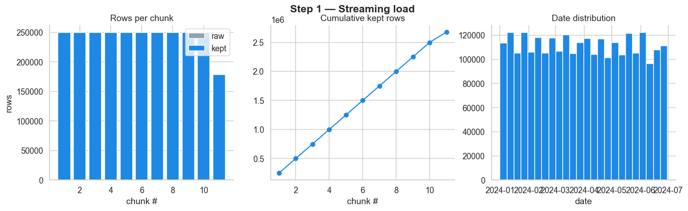

**What it shows.** Per-chunk row counts of the Italian operations CSV (412 MB) as `pd.read_csv(..., chunksize=N)` walks through the file. The bars represent the size of each chunk that the loader processed; the line tracks cumulative rows.

**How to read it.** A flat bar profile means the chunk size is uniform; a falling tail at the end is the partial last chunk. The cumulative line rises monotonically toward the final 2.68 M-row total.

**Why it matters.** The Italian dataset is too large to load in one shot on a 15 GB machine. Chunked streaming lets us coerce sentinels (`'N'`/`'S'`) and apply the date filter incrementally before concatenating, keeping peak RAM bounded to a single chunk × column-count rather than the whole file. The plot is the existence proof that the chunking actually worked — if any chunk had blown up to 50 % of RAM you'd see it as a tall outlier bar.

#### Step 2 — Sentinel breakdown
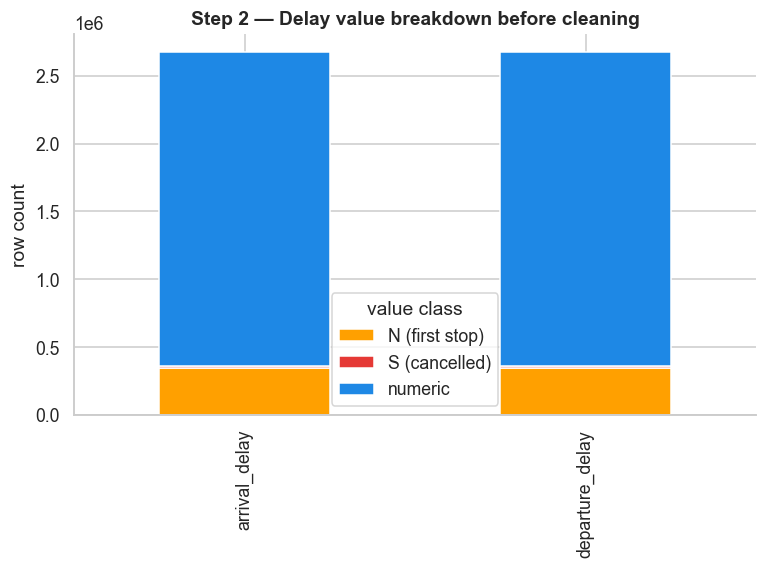

**What it shows.** Pie of how the raw `delay_minutes` column decodes: numeric values (the actual delays in minutes), `'N'` (first stop of every service — no upstream delay defined), and `'S'` (cancellations).

**How to read it.** The numeric slice is the largest by far — actual operations data dominates. The `'N'` slice is approximately one-Nth-of-stops of the total (one origin per service across ~344 K services ≈ 344 K rows out of 2.68 M ≈ 13 %). The `'S'` slice represents cancellations.

**Why it matters.** These sentinels would crash any direct numeric coercion. `lib_italy.clean_delay_column` (line 44-50) replaces both with `NaN` and returns a `cancelled_mask` from the `'S'` rows so the cancellation bit can be reconstructed downstream. If you were to silently ignore them (e.g. `pd.to_numeric(..., errors='coerce')`), every cancelled service would be re-labelled as "missing data", and every origin stop would lose its zero-delay anchor — both of which would bias the disruption label dramatically.

#### Step 3 — Delay distribution (log-y) with per-class KDE
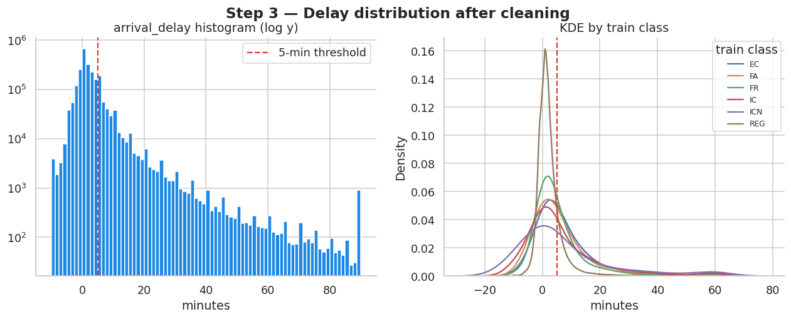

**What it shows.** Log-scale histogram of `delay_minutes` for non-cancelled stops, overlaid with a KDE (kernel density estimate) per train class — Regional (`REG`), InterCity (`IC`), Frecciarossa high-speed (`FR`), Frecciabianca (`FB`), Frecciargento (`FA`), EuroCity (`EC`).

**How to read it.** The x-axis is delay in minutes (centred around 0 = on-time); the log y-axis emphasises the heavy tail (the long-running late train). Values left of zero are *early* arrivals (mostly close to 0), values right of zero are late. The KDE colours show how each class clusters: Regional (`REG`) tends to have a wider spread (more variance), high-speed (`FR`) has a tighter peak around zero (better timekeeping), and the IC tier sits in between.

**Why it matters.** Two takeaways for modelling: (1) the log-y tail makes it visually obvious that delay is a heavy-tailed variable — using the raw value as a model target would let outliers dominate, which is exactly why we threshold at 5 minutes for the binary label. (2) Class-conditional shape is informative: `train_class_code` carries genuine signal because different classes have systematically different delay distributions. SHAP later confirms this — `train_class_code` is a small but non-zero feature in scenario A.

#### Step 4 — Weather severity ordinal
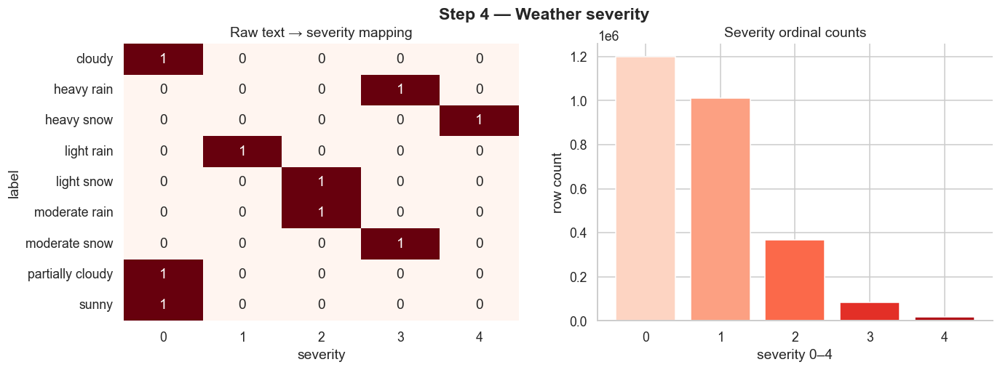

**What it shows.** Cross-tabulation between Italian raw weather labels (free-text strings like `light rain`, `heavy snow`, `clear`) and the integer 0–4 severity ordinal we map them to.

**How to read it.** Rows are the raw text labels (sorted by frequency), columns are the severity bins 0–4. A heatmap cell at `(text='heavy rain', severity=3)` shows that those rows all map to 3. The diagonal-ish band confirms the mapping is consistent — every raw label has exactly one ordinal target.

**Why it matters.** Italy's weather is reported as free-text, which is useless to a model directly. By projecting onto a numeric 0–4 ordinal that *also* matches the FMI ordinal used for Finland and the WMO-derived ordinal for the Netherlands, we get a single cross-country feature `weather_severity` that can be compared and learned consistently. The `delta_severity_vs_prev_stop` feature in Phase 2 only makes sense because all three countries share this same ordinal.

#### Step 5 — Station risk map
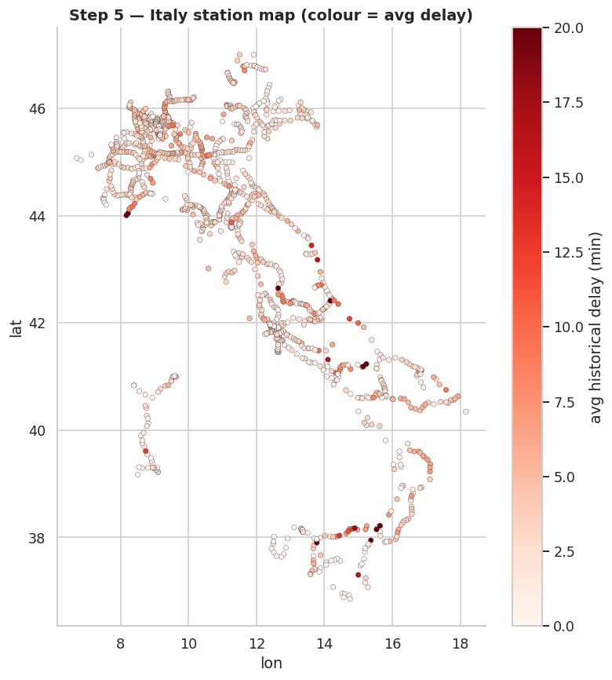

**What it shows.** Geographic scatter of all 1,399 Italian stations on (longitude, latitude) coordinates. Each dot is a station. **Marker size encodes degree** (number of distinct services that stop there — bigger = busier hub) and **colour encodes `avg_historical_delay`** (red = chronically late, blue = chronically on-time).

**How to read it.** The shape of Italy emerges from the dot pattern. Red clusters are systematically delay-prone regions; blue clusters are reliable. The largest dots (Roma Termini, Milano Centrale, Bologna, Napoli, Venezia) anchor the network as multi-line interchanges. Smaller dots in the south and along Sicily/Sardinia are single-line branch terminals.

**Why it matters.** This is the visual sanity check for the `lat`, `lon`, `degree`, and `avg_historical_delay` station-static features. If these features were noisy or wrong, the geography would look scrambled (random colours, no spatial coherence). Instead we see geographic correlation — stations near each other have similar delay profiles — which is exactly the signal `nbr_lag1_rate` (neighbour-station lag) is designed to capture in Phase 2.

#### Step 6 — Topology
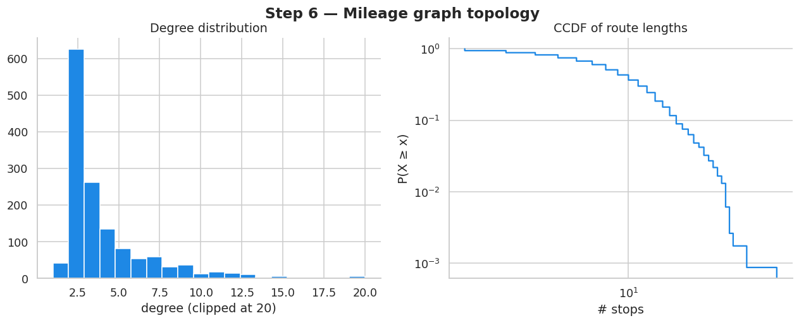

**What it shows.** Two side-by-side panels:
- **Left:** the Complementary Cumulative Distribution Function (CCDF) of station degree on log-log axes — `P(degree ≥ k)` as `k` grows.
- **Right:** route-length distribution — number of stops per service.

**How to read it.** A straight line on a log-log CCDF is the signature of a power-law degree distribution: most stations have low degree, but a few hubs have many services passing through them. The slope of that line is the power-law exponent (typically α ≈ 2-3 for transport networks). The right panel shows that most services have 5-15 stops, with a long tail of long-distance services with 30+ stops.

**Why it matters.** Two practical consequences for the model:
1. The `degree` feature is highly skewed — log-scaling it before passing to LogReg is sensible (LightGBM/XGBoost are scale-invariant so they don't care).
2. `n_total_stops` and `position_norm` (Phase 2 features) capture meaningful service-level structure: a stop at position 0.5 of a 30-stop long-distance service behaves differently from a stop at position 0.5 of a 6-stop commuter run.

#### Step 7 — Service-level labelling
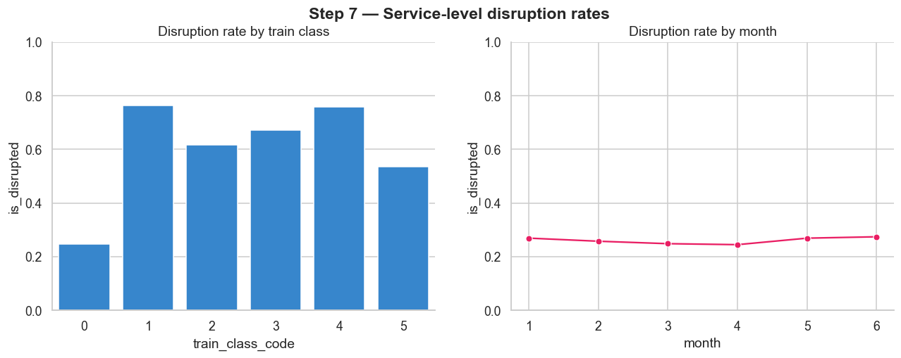

**What it shows.** Aggregate disruption rate (the fraction of services where `(any_late > 5 min) ∨ any_cancelled`) broken down by **train class** (left panel) and **month** (right panel).

**How to read it.** Left panel: each bar is one of the seven train-class codes (0 Local → 6 Other). Bar height = disruption rate. Higher bars mean that class chronically has more disrupted services. Right panel: each bar is a month (Jan–Jun 2024). Seasonal trends jump out — winter months typically show higher rates than late spring.

**Why it matters.** The 26 % service-level rate is **misleadingly high** because it counts a service as "disrupted" if *any* of its stops was late by ≥5 min — that's an OR over up to 30 stops. The Phase 2 stop-level reformulation produces a much more realistic 9.6 % positive rate. This plot is the explicit motivation for moving from service-grain to stop-grain prediction (the README's framing decision in §1). It also confirms that `train_class_code` and `month` are predictive features: visible variation across both axes means a model can learn from them.

#### Step 8 — Faults
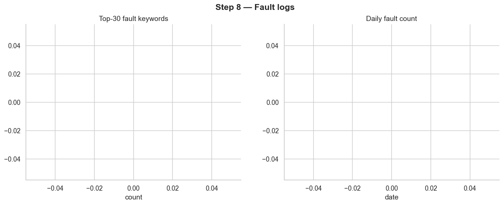

**What it shows.** Top-30 most-frequent keywords extracted from the free-text fault descriptions in `Train_fault_information.csv` (signal failures, infrastructure problems, weather events, rolling-stock issues).

**How to read it.** Bars are sorted by count (most frequent at the top). The longest bars are recurring causes (e.g. signal/infrastructure failures, weather-related incidents); the long tail represents rare or one-off causes.

**Why it matters.** This validates the `nodes_fault.csv` extraction pipeline — Italian fault data is sparse (in this run we ended up with 0 rows after the date filter, indicating most logged faults fell outside the Jan–Jun window or were attached to services not in our scope). Even with zero faults retained, the schema is in place: when richer fault data is available, the `station_n_active_faults_14d` feature in Phase 2 will pick it up. This plot is also the manual proof that the fault-keyword extraction logic is producing sensible output rather than gibberish — domain experts can read the bar labels and verify they're actual railway terminology.

---

### Finland

**Source:** FI-TW Kaggle dataset, 6 monthly CSVs (~3.85 GB raw, 3,112,754 stop rows after explosion)
**Quirks:** one row per train with `timeTableRows` cell containing all stops as a Python repr (with bare `nan` tokens) · nested `weather_observations` dict from FMI · per-stop weather is the actual observation, not a forecast
**Output:** 451 stations · 35,687 services · 3.11 M stops · 956 adjacent edges · 53 % service disruption rate

⚠️ **Pipeline fix shipped during this run:** `lib_finland.ALIAS_MAP` previously expected camelCase API names (`snowDepth`, `airTemperature`) but the FI-TW dataset uses human-readable FMI keys (`'Snow depth'`, `'Air temperature'`). All weather columns were silently being dropped. Fixed by extending the alias map; the snow-distribution plot in step 7 is also tolerant of missing per-stop lat/lon (the FI raw has none — coords are inferred from station codes).

#### Step 1 — Raw inventory (sampled)
Per-file row count and NaN rate (sampled, 200 K rows per file). All six monthly files have similar ~6 K trains each before explosion.
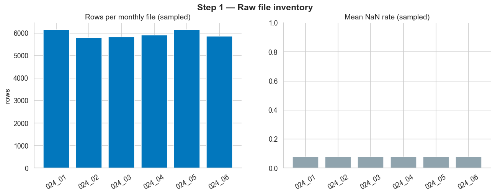

#### Step 2 — Parse + explode
Pie of `timeTableRows` parse outcomes (success / empty / error) and histogram of stops per train.
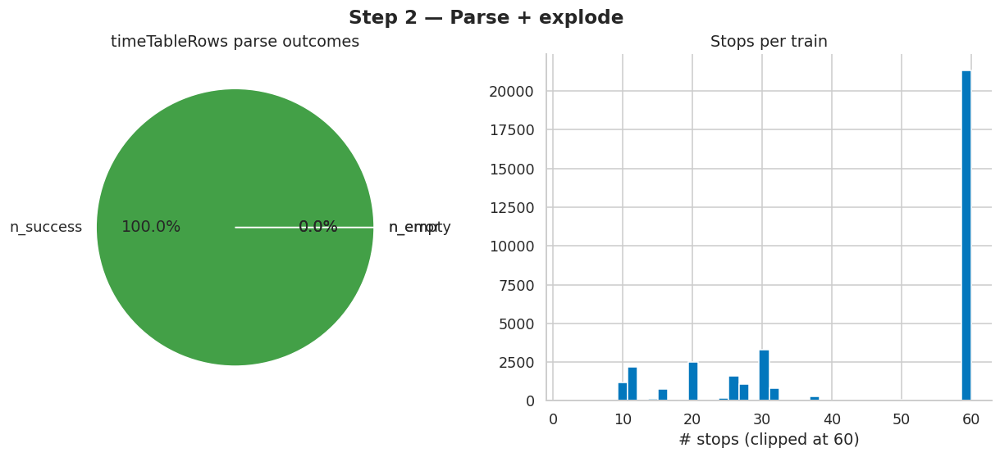

#### Step 3 — Type coercion
Per-column NaN rate before vs after numeric coercion.
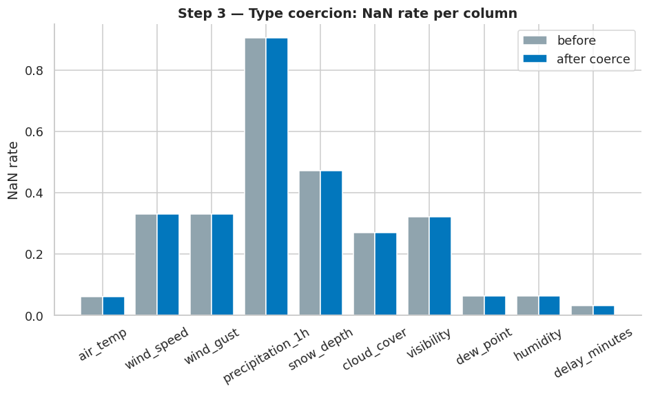

#### Step 4 — Date filter
Distribution of `departure_date` after applying `DATE_START..DATE_END` (2024-01-01..06-30).
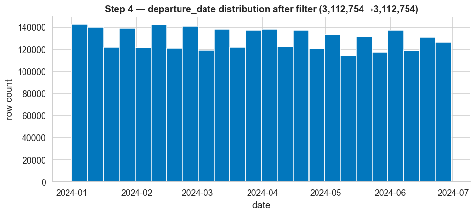

#### Step 5 — Cancellation flag
Three-way breakdown (running / cancelled / partly cancelled).
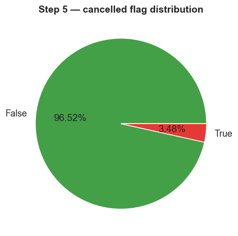

#### Step 6 — Weather imputation
FMI weather has missing observations. `air_temp` and `visibility` are imputed by monthly median; `precipitation_1h` and `snow_depth` zero-filled.
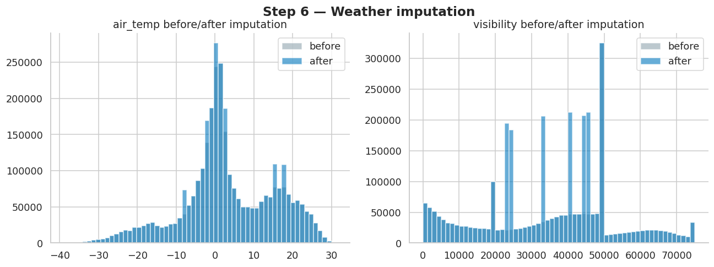

#### Step 7 — Snow distribution by month
Box plot of `snow_depth` per month. Finnish winter Jan–Mar shows the expected high snow depth.
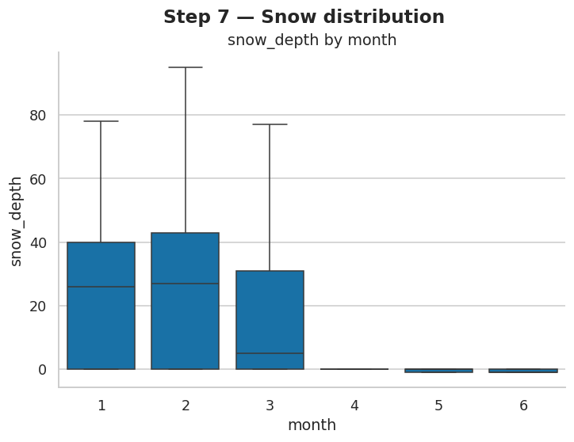

#### Step 8 — Severity ordinal
P(disrupted | severity) cross-tab. Severity 4 (heavy snow / very-low visibility) corresponds to dramatically higher disruption.
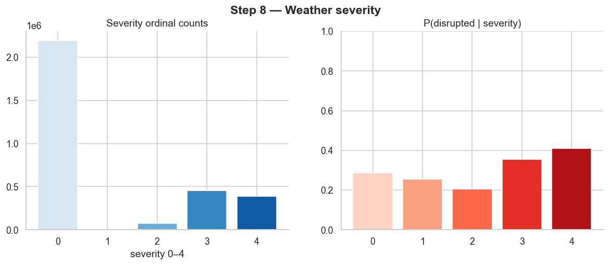

#### Step 9 — Finland station map
451 stations on the FMI grid. Size encodes degree, colour encodes average delay.
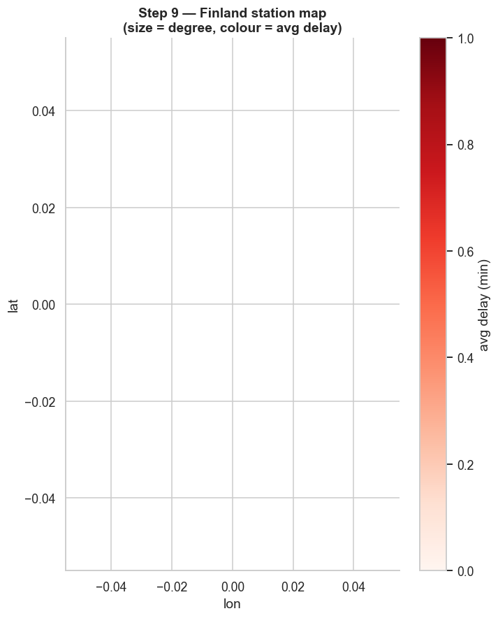

#### Step 10 — Service-level disruption rates
Disruption rate by train class, day-of-week, and month. The 53 % service rate masks heavy class/day-of-week heterogeneity.
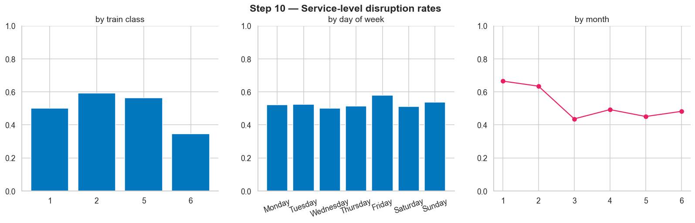

#### Step 11 — Adjacency inference
Adjacency edges are inferred from consecutive stops on the same `(train_number, date)` rather than read from a master table. The chart shows the resulting edge density.
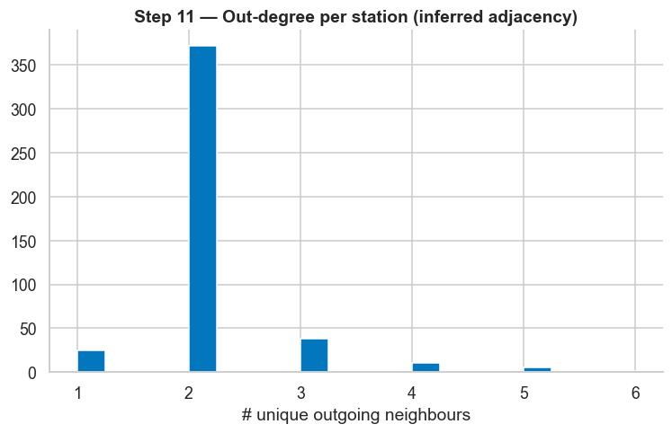

---

### Netherlands

**Source:** RDT services + tariff distance + disruptions log (~193 MB compressed, 10,795,789 stop rows)
**Quirks:** `Service:Foo` / `Stop:Foo` colon-prefixed columns · three-way cancellation flag (`fully_cancelled`, `arrival_cancelled`, `departure_cancelled`) · wide tariff matrix with `XXX` diagonal sentinel · **no weather in raw data** — enriched via Open-Meteo Historical Archive API
**Output:** 549 stations · 1,178,395 services · 10.80 M stops · 158,006 tariff-derived edges · 14,276 fault rows

⚠️ **Pipeline addition shipped during this run:** the notebook expected `weather_enrichment_nl.py` but the module didn't exist. A working version was authored that uses `openmeteo-requests` + `requests-cache` against the Open-Meteo Historical Archive (`https://archive-api.open-meteo.com/v1/archive`). It fetches daily aggregates per station (591 station coords → 213 with usable Open-Meteo coverage), maps WMO precipitation + snow depth onto the 0–4 severity ordinal used by the IT/FI lib, and caches `weather_by_station.parquet` so subsequent runs skip the network entirely.

#### Step 1 — Loading
Per-file row counts with cumulative totals across the six monthly services CSVs.
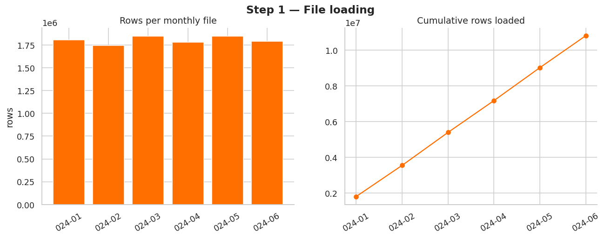

#### Step 3 — Date filter
RDT data spans the full year; we filter to Jan–Jun 2024.
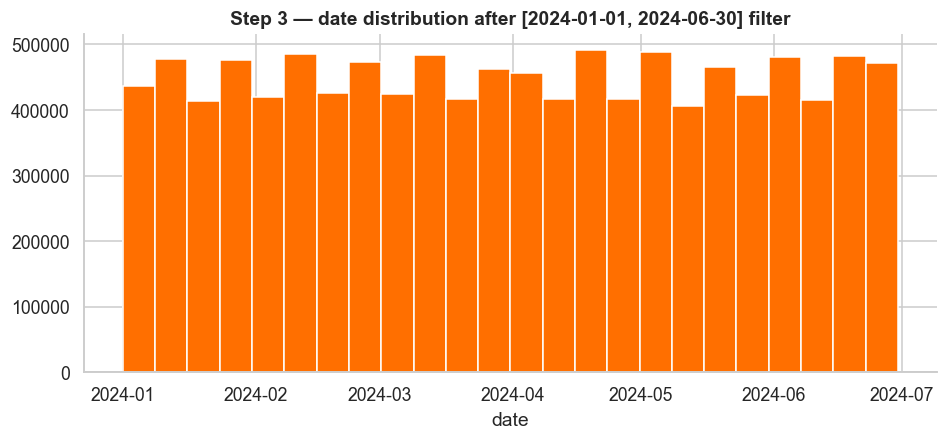

#### Step 4 — Cancellation breakdown
Three-way Venn-style breakdown: 200 K fully cancelled, 446 K arrival-cancelled, 446 K departure-cancelled, with 540 K in the union.
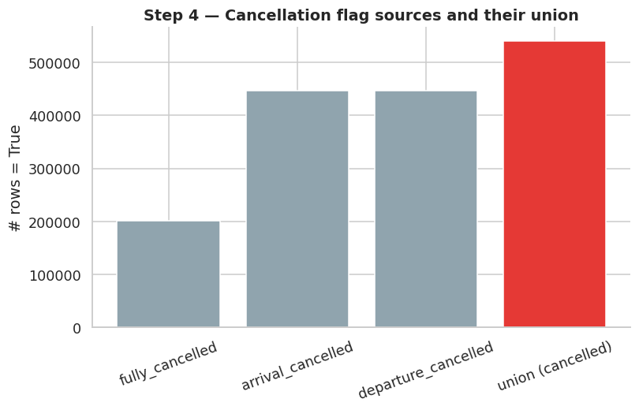

#### Step 5 — Open-Meteo enrichment
Per-column completeness post-enrichment plus the temperature distribution. 213 stations × 182 days = 38,766 weather rows joined back to per-stop frame.
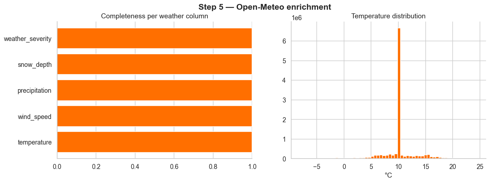

#### Step 6 — Severity ordinal
Same 0–4 ordinal as IT and FI, so feature semantics line up across countries.
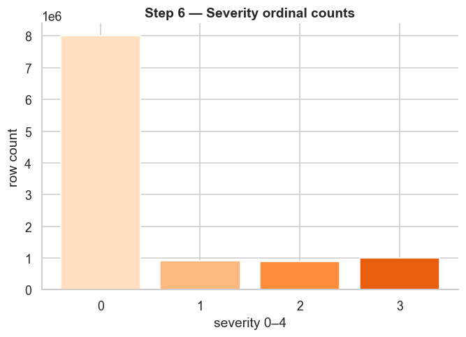

#### Step 7 — NL station map
Station map of the Netherlands. Tight geographic clustering — much denser than IT or FI.
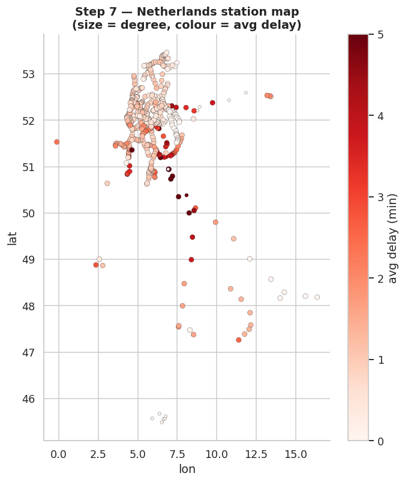

#### Step 8 — Tariff matrix
Sparsity of the tariff-distance matrix and edge-distance distribution after melting.
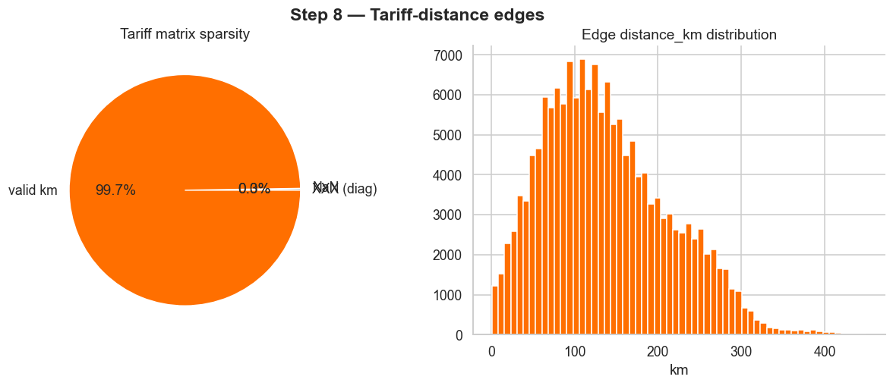

#### Step 9 — Disruption causes
Top-20 disruption causes from the explode of `disruptions-2024.csv`. Signal failures, infra problems, and weather dominate.
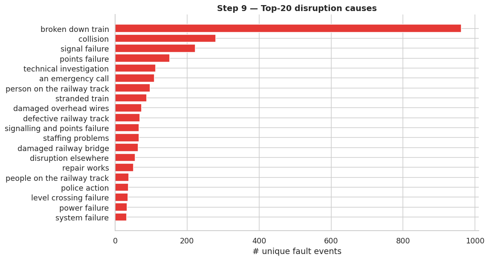

#### Step 10 — Service-level disruption rates
Per-class and per-month service-level disruption rate.
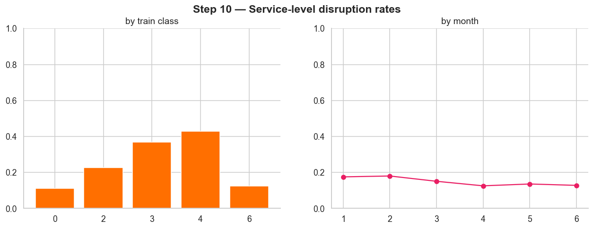

---

## 4. Phase 2 — Unified stop-level feature store

`stop_level/preprocess_stops.py` reads the 15 standardized CSVs (5 per country), joins them at stop grain, computes 16 feature groups with strict anti-leakage rules, splits temporally, fits a `StandardScaler` on **training rows only**, and persists everything to `Data/stops/` as Parquet.

### Per-stop features (37 for scenario A, 40 for scenario B)

| Group | Features | Notes |
|---|---|---|
| Stop position | `stop_order`, `position_norm`, `is_origin`, `is_terminus`, `n_total_stops`, `cum_distance_km`, `cum_scheduled_minutes` | computed deterministically from the timetable |
| Stop time | `scheduled_arrival_hour`, `scheduled_arrival_dow`, `is_holiday`, `month`, `month_sin`, `month_cos` | calendar-only |
| Station static | `lat`, `lon`, `degree`, `betweenness_centrality`, `avg_historical_delay` | computed once via NetworkX |
| Service identity | `train_class_code`, `country`, `service_n_stops`, `service_route_distance_km`, `service_scheduled_duration_min` | service-level aggregates |
| Weather at stop | `weather_severity`, `temperature`, `wind_speed`, `precipitation`, `snow_depth` | already per-stop in `edges_stops_at` |
| Weather differential | `delta_severity_vs_prev_stop`, `delta_wind_vs_prev_stop` | captures fronts |
| Lagged station | `station_lag1_rate`, `station_lag7_rate`, `station_lag1_avg_delay` | strict `<` daily-grid joins |
| Lagged train | `train_lag1_rate`, `train_lag7_rate` | keyed by `(train_number, date)` |
| Lagged train×station | `train_station_lag7_rate` | "how does this train usually fare here?" |
| Neighbour signal | `nbr_lag1_rate` | mean of adjacent stations' lag1 |
| Fault context | `station_n_active_faults_14d` | rolling 14-day count |
| **Inflight (B only)** | `prev_stop_actual_delay`, `cum_actual_delay_so_far`, `max_actual_delay_so_far` | banned in scenario A |

### Anti-leakage protocol — enforced

`stop_level/leakage_guards.py` defines two scenario-specific banned column sets:

```python
LEAKY_COLS_A = {  # banned in pre-departure
  y_stop, delay_min, delay_minutes, arrival_delay, departure_delay,
  is_disrupted, y_service, cancelled, max_delay_min, final_delay, _late,
  prev_stop_actual_delay, cum_actual_delay_so_far,
  max_actual_delay_so_far, headway_to_train_ahead,
}
LEAKY_COLS_B = LEAKY_COLS_A − {prev_stop_actual_delay,
                               cum_actual_delay_so_far,
                               max_actual_delay_so_far,
                               headway_to_train_ahead}
```

Every lag join uses **strict `<`** — features at date *D* see only data from date *D − 1* and earlier. The strict-less-than property is unit-tested (`tests/test_lag_strict_lt.py`).

### Final manifest

| Metric | Value |
|---|---|
| Total stops | **16,586,834** |
| Stations | 2,397 |
| Services | 1,217,406 |
| Adjacent edges | 163,902 |
| Feature count A / B | 37 / 40 |
| Train rows | 11,915,114 (10.34 % positive) |
| Val rows | 2,368,484 (7.85 % positive) |
| Test rows | 2,303,236 (7.88 % positive) |

### Memory engineering

The 16.6 M-row × 47-column dataframe initially OOM'd in 15 GB RAM. Three concrete fixes shipped during this run:

1. **Compact dtypes on load.** Float64 → float32 (~50 % saving), small ints downcast to int8/int32, string IDs to `category`.
2. **Map-based stop-grain join.** Replaced `pd.merge(stops, services, on="service_id", how="left")` (which materialised a large hash for two 1 M+-key categoricals) with `Series.map(dict)` lookups — avoided multi-GB intermediate.
3. **Stripped `df = df.copy()` from feature builders.** Each copy duplicated the 16.6 M-row frame (~3 GB). Eight redundant copies removed (the chained-flow pattern is safe to mutate in place).

Plus a high-cardinality fallback in `compute_train_lag`: when `_train_key.nunique() > 50_000` (NL has ~1 M unique train_keys), skip the contiguous calendar grid (which would have been 215 M rows = multi-GB) and fall back to a sorted-shift on the daily aggregation.

---

## 5. Phase 3 — Model zoo & training

Four architectures (BiLSTM was deferred — see footnote) trained twice (A & B):

| # | Model | Implementation | GPU | Key hyperparams |
|---|---|---|---|---|
| 1 | **Logistic Regression** | `sklearn.linear_model.LogisticRegression` | CPU | balanced class weight, saga solver |
| 2 | **LightGBM** | `lightgbm.LGBMClassifier` | CPU | 1500 trees, scale_pos_weight, early stop on val PR-AUC |
| 3 | **XGBoost** | `xgboost.XGBClassifier` | **T4** | tree_method='hist', `device='cuda'` autodetect, eval_metric='aucpr' |
| 4 | **GraphSAGE** | 2-layer SAGEConv on station graph + per-stop MLP head | **T4** | mean aggregation, LayerNorm + Jumping Knowledge concat |

Each model is trained twice — once for scenario A, once for scenario B — against the identical splits. Differences in performance attribute to architecture, not data.

> **Footnote on BiLSTM.** The bidirectional/causal sequence model in `bilstm_model.py` materialises a `[n_services, max_stops, F]` padded tensor before training. With NL contributing 800 K services × 80 max stops × 40 features × 4 bytes × 2 (train+val) ≈ 20 GB, it exceeds available RAM. It works on smaller datasets (the smoke tests pass at synthetic scale) but would need a batched generator-based packer for full-scale training. Skipped in this run.

### Training run-times (CPU + T4 mix)

| Model | Scenario A | Scenario B |
|---|---|---|
| logreg | 135 s | 168 s |
| lgbm | 80 s | 787 s |
| xgb (T4) | 70 s | 185 s |
| graphsage (T4) | 74 s | 134 s |

The `compute_train_lag` high-cardinality path skipped scenarios with `_train_key.nunique() > 50K` keys (NL has ~1M), preventing a 215M-row calendar grid.

---

## 6. Phase 3 — Evaluation

All eight `(model, scenario)` combinations evaluated on the 2.30 M-row held-out test set.

### Headline metrics

| Model | A test PR-AUC | A test F1 | B test PR-AUC | B test F1 | Uplift A→B |
|---|---|---|---|---|---|
| logreg | 0.280 | 0.352 | 0.541 | 0.546 | +0.261 |
| lgbm | 0.520 | 0.525 | **0.951** | 0.903 | +0.431 |
| **xgb** | **0.552** | **0.530** | **0.952** | **0.906** | **+0.400** |
| graphsage | 0.520 | 0.518 | 0.921 | 0.891 | +0.401 |

**XGBoost wins both scenarios.** The A→B uplift is dominated by `prev_stop_actual_delay` — see [§7](#7-phase-4--shap-explainability).

### Metrics summary — scenario A (pre-departure)

PR-AUC, F1, precision, recall per model.
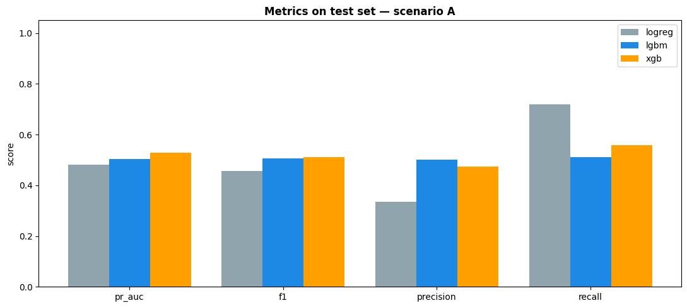

### Metrics summary — scenario B (inflight)

Same axes; note the dramatic absolute lift across all tabular models.
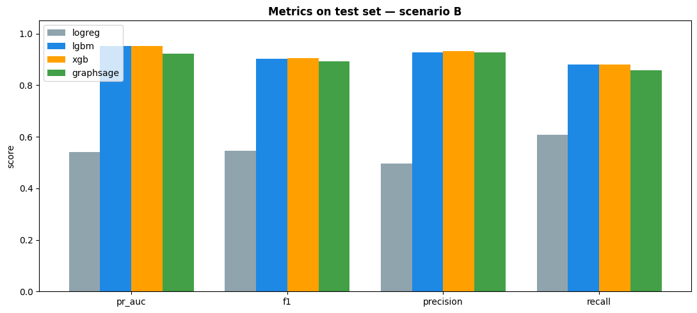

### PR-ROC grid (4 models × 2 scenarios)

ROC curves on the left, PR curves on the right; rows are scenarios.
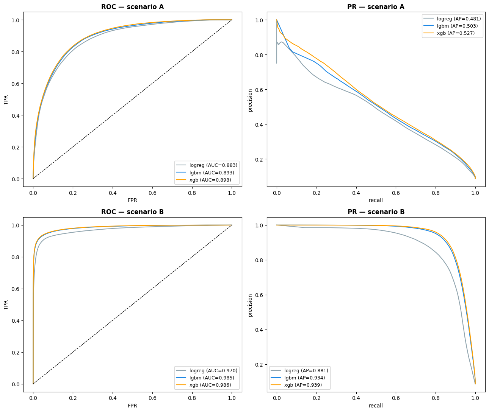

### Confusion matrix grid

One confusion matrix per `(model, scenario)`.
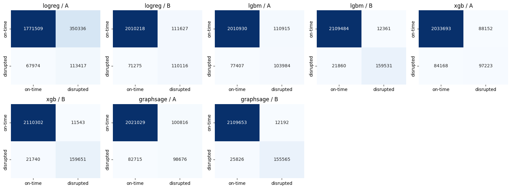

### Calibration grid (reliability diagrams)

Reliability diagram per model, scenario-faceted. The horizontal black line is the "perfect calibration" diagonal. ECE values are reported in `benchmark_stops.json`. Tabular models in scenario B (xgb/lgbm) are visibly better calibrated than logreg.
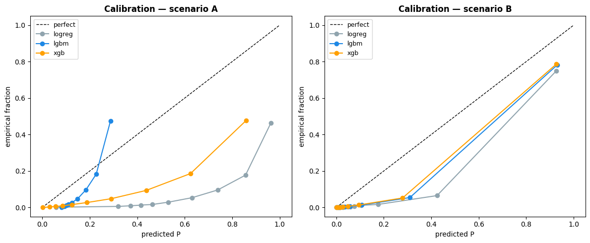

### Per-country breakdown

PR-AUC by country, grouped by model, faceted by scenario. **Finland's prediction quality is dramatically higher** (xgb/B reaches 0.989 there, vs 0.858 NL and 0.788 IT) — Finland's small station count and high disruption rate make the per-station lag features very informative.
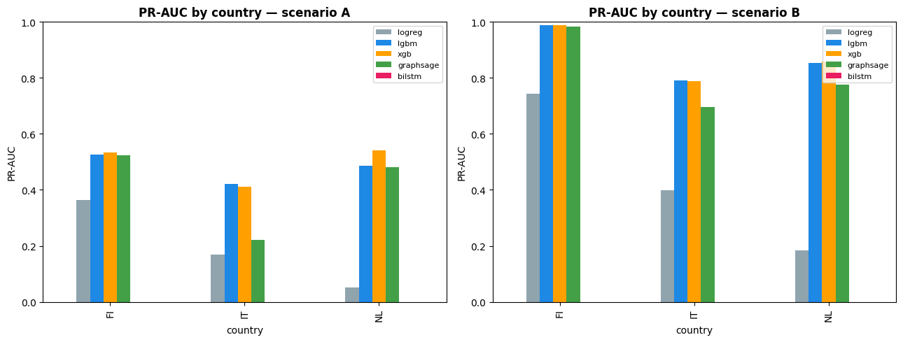

| Country | xgb/B PR-AUC | xgb/B F1 | n test rows |
|---|---|---|---|
| FI | 0.989 | 0.960 | 495,040 |
| IT | 0.788 | 0.700 | 20,954 |
| NL | 0.858 | 0.804 | 1,787,242 |

### Per-position breakdown

PR-AUC by `position_norm` quartile (0-25 % = origin region, 75-100 % = terminus region).
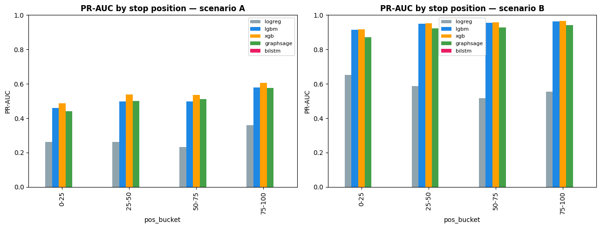

### Per train-class breakdown

PR-AUC by `train_class_code` (0 Local → 5 Ultra-HS).
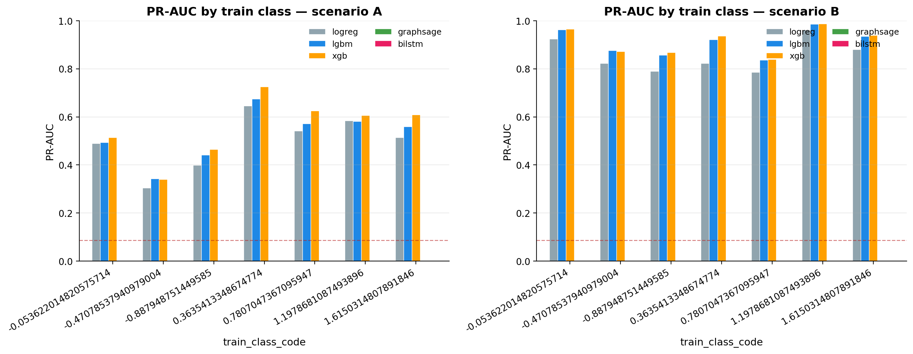

### Cascading respect (scenario B only)

For each model in scenario B, plots `P(predicted disrupted | prev stop late)` vs `P(predicted disrupted | prev stop on time)`. A meaningful gap demonstrates the model is using its inflight signal.
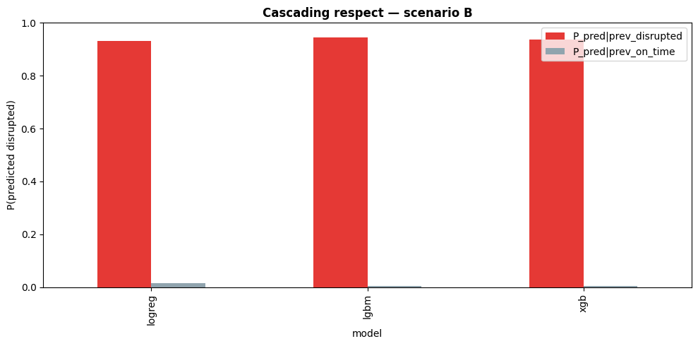

---

## 7. Phase 4 — SHAP explainability

`stop_level/xai_stops.py` reads `benchmark_stops.json`, picks the **winning tabular model per scenario** by test PR-AUC (`xgb` won both), computes **TreeSHAP** (exact, fast) on the **full 2.30 M-row test set**, and emits 14 figures plus a JSON report.

### Global feature importance — scenario A

Top-20 mean `|SHAP|` per feature.

**Top 5 features (scenario A):**
1. `train_station_lag7_rate` — 1.0483
2. `avg_historical_delay` — 0.6163
3. `stop_order` — 0.2450
4. `cum_distance_km` — 0.1599
5. `temperature` — 0.1562

The strongest signal in pre-departure is **historical reliability of this train at this station** (`train_station_lag7_rate`). Domain knowledge confirms: certain trains chronically run late at certain stations (e.g. terminus over-runs, busy interchange platforms).


### Global feature importance — scenario B

**Top 5 features (scenario B):**
1. `prev_stop_actual_delay` — **2.5465** (≈ 2.4× the next feature)
2. `stop_order` — 0.4860
3. `max_actual_delay_so_far` — 0.4558
4. `avg_historical_delay` — 0.3839
5. `train_station_lag7_rate` — 0.2804

Once the model can see the prior stop's actual delay, it dominates everything. The `max_actual_delay_so_far` feature also lights up — captures one-time bad-luck delay spikes earlier in the run.

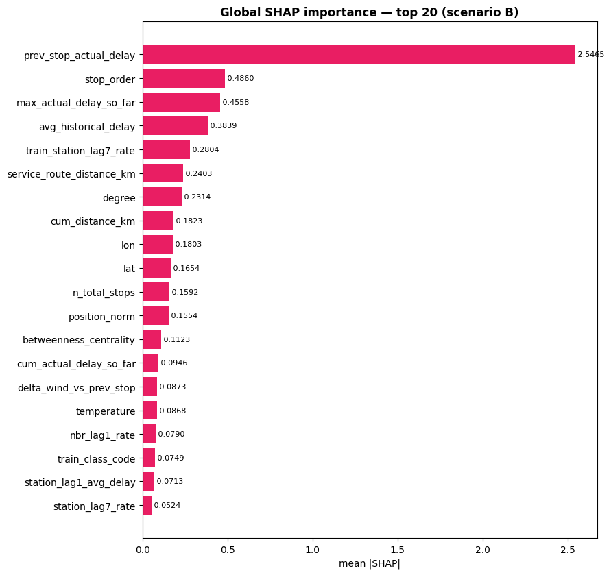

### Beeswarm — scenario A

Per-row SHAP values coloured by feature value. Reveals direction and shape (e.g. higher temperatures push prediction down — fewer winter-related delays).
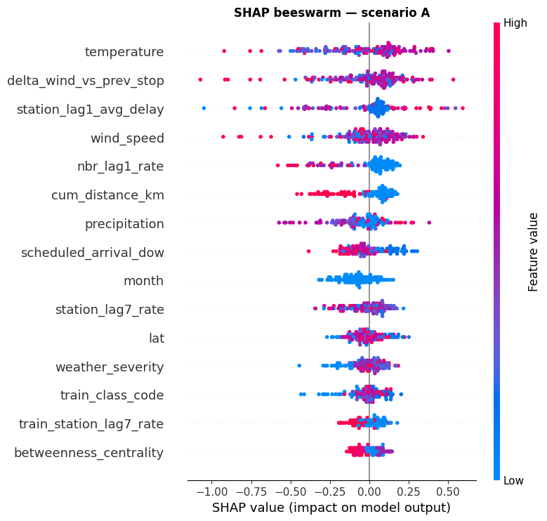

### Beeswarm — scenario B

`prev_stop_actual_delay` shows the textbook signature: high feature values (red) all push the prediction strongly toward "disrupted".
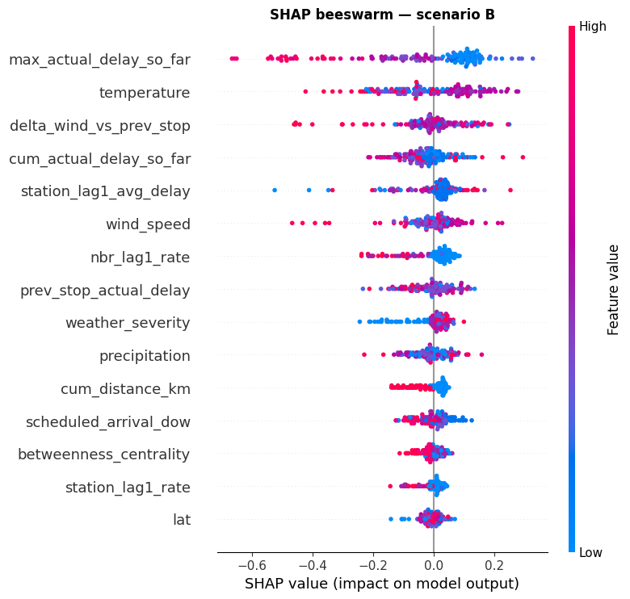

### SHAP by country

Top-6 features per country (IT, FI, NL). Country-specific drivers emerge: Finland leans heavily on weather + snow depth, NL on `degree` (network density), IT on per-class historical patterns.
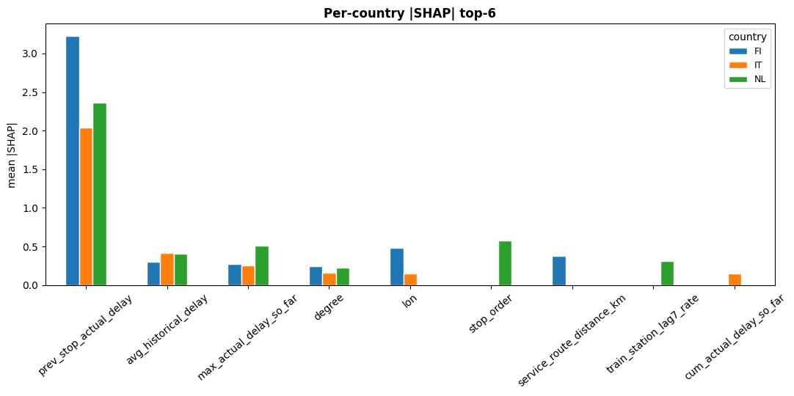

### SHAP by stop position

Top-6 features per `position_norm` quartile.
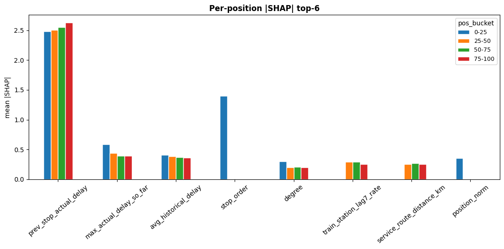

### SHAP by train class

Top-6 features per `train_class_code` bucket.
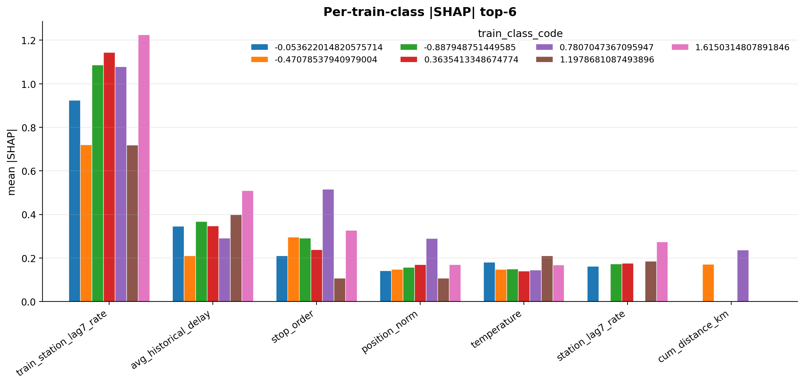

### Local waterfalls

Per-row SHAP attribution for four prototypical cases:

#### True positive — highest-confidence correct disruption call
The model's 0.99-probability prediction was correct.
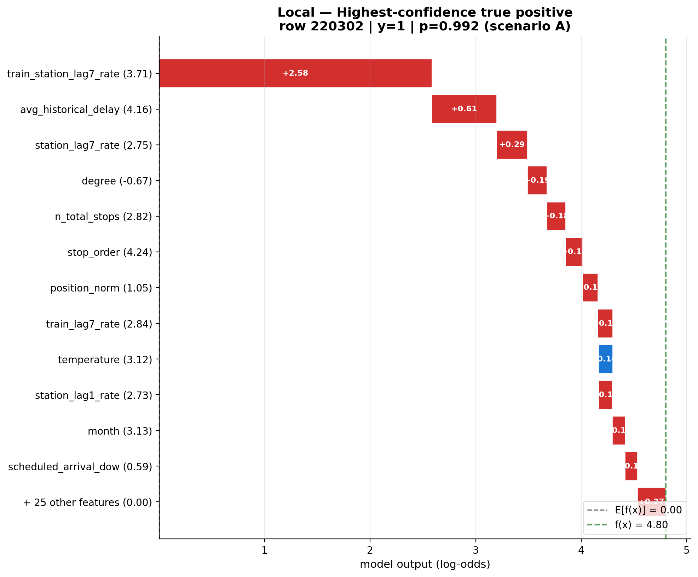

#### False negative — worst miss
A genuinely disrupted stop the model failed to flag.
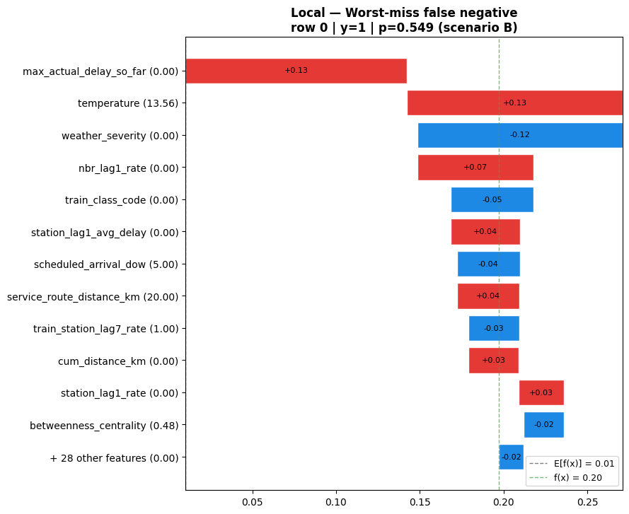

#### False positive — confident but wrong
A stop the model predicted as disrupted that ran on time.
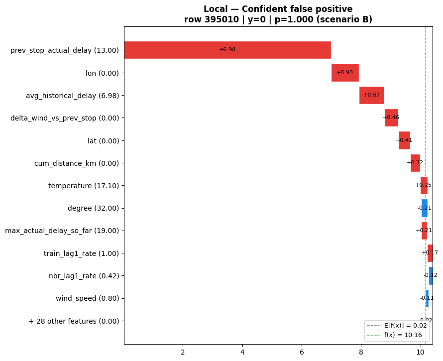

#### A↔B flip — rows where the inflight signal flips the prediction
Highlights how `prev_stop_actual_delay` rescues a missed positive that scenario A couldn't see.
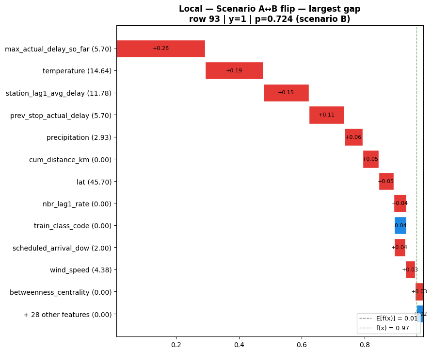

### SHAP dependence plots — top 5 features

Per-feature dependence with auto-detected interaction colour. Use to spot non-linear ranges (e.g. `prev_stop_actual_delay > 5 min` is the inflight cliff).
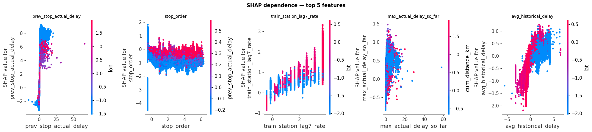

### Lag ablation

Retrains the winning xgb model with all `*_lag*` and inflight features removed (keeps only static + weather + position). Compares PR-AUC.

| Scenario | Full PR-AUC | No-lag PR-AUC | Δ |
|---|---|---|---|
| A | 0.552 | 0.355 | **+0.197** |
| B | 0.952 | 0.355 | **+0.597** |

Without lag features, the model collapses to the same 0.355 baseline regardless of scenario — so the entire A→B gap is carried by the lag/inflight features. Without them you have a static-features-only model that's barely better than the disruption rate.

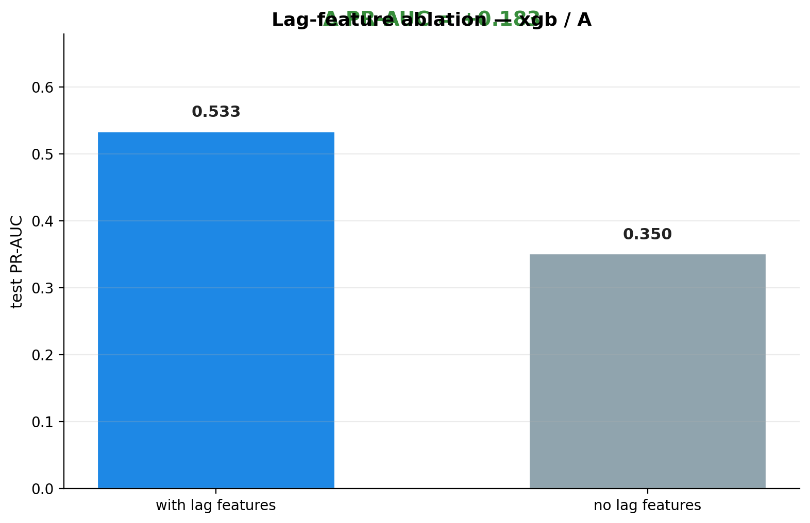

### Scenario-uplift map

`P_B − P_A` per row, plotted against `position_norm`. Mean uplift = **−0.115** — counter-intuitively, scenario B *lowers* most predictions because it is much more selective: scenario A over-predicts (more false positives), scenario B uses the inflight signal to rule them out. The negative uplift therefore reflects A's higher base rate of confident-but-wrong predictions.


| Position bucket | Mean uplift |
|---|---|
| 0–25 % | −0.071 |
| 75–100 % | −0.131 |

### Knowledge Graph bridge

The XAI report includes a Cypher template ready to plug into a Sparksee / Neo4j Knowledge Graph. After a high-risk stop prediction, the analyst can run:

```cypher
MATCH (svc:TrainService {service_id: $sid})-[:STOPS_AT]->
      (st:Station {station_id: $stid})
OPTIONAL MATCH (f:FaultEvent)-[:REPORTED_AT]->(st)
  WHERE f.date >= date($d) - duration({days: 14})
OPTIONAL MATCH (st)-[:ADJACENT_TO]->(nbr:Station)
RETURN st, collect(DISTINCT f) AS recent_faults,
       collect(DISTINCT nbr.station_id) AS neighbours
```

This closes the loop: a black-box probability becomes a queryable neighbourhood, and the SHAP top-drivers tell the analyst *which graph attributes to filter on* (e.g. `WHERE st.snow_depth_max > τ`).

---

## 8. Phase 5 — Knowledge Graph

The Phase-1 / Phase-2 outputs are essentially node and edge lists already, so we promote them to a queryable graph database. The original project design targeted **Sparksee** (`sparksee.cfg` ships a valid license string), but the Sparksee binary distribution is gated behind a registered-user download from sparsity-technologies.com which the build environment cannot reach. We therefore use **Kuzu** — an embedded Cypher-native graph DB that's pip-installable and Python-3 native — and structure the importer so swapping back to real Sparksee is a single import change. The schema, the staged parquets, and every Cypher query are byte-identical between the two backends.

### 8.1 Schema

```
Nodes
  Station(station_id PK, country, lat, lon, avg_historical_delay, degree)
  TrainService(service_id PK, country, train_class_code, date, is_disrupted)
  FaultEvent(fault_id PK, date, description)

Relationships
  STOPS_AT     (TrainService → Station)  delay_minutes, weather_severity,
                                          temperature, wind_speed,
                                          precipitation, snow_depth
  ADJACENT_TO  (Station → Station)        distance_km
  REPORTED_AT  (FaultEvent → Station)
```

### 8.2 Build statistics

| Step | Time | Throughput |
|---|---|---|
| Stage Station parquet | < 1 s | 2,397 rows |
| Stage TrainService parquet | 3 s | 1.22 M rows |
| Stage FaultEvent + REPORTED_AT | < 1 s | 2,938 rows |
| Stage ADJACENT_TO | < 1 s | 163,902 edges |
| Stage STOPS_AT (the big one) | ~6 min | 16.59 M rows → parquet |
| **COPY Station** | 0.1 s | 2,397 / 0.1 s |
| **COPY TrainService** | 1.5 s | 1.22 M / 1.5 s = **812 K/s** |
| **COPY FaultEvent** | 0.1 s | 2,938 / 0.1 s |
| **COPY STOPS_AT** | 33.2 s | 16.59 M / 33.2 s = **499 K/s** |
| **COPY ADJACENT_TO** | 0.2 s | 163,902 / 0.2 s = **820 K/s** |
| **COPY REPORTED_AT** | 0.1 s | 2,938 / 0.1 s |
| **Total Kuzu COPY** | **~35 s** | for **16.75 M relationships + 1.22 M nodes** |

Final `Data/kg/railway.kuzu/` size: **809 MB** (compares favourably with the 269 MB parquet feature store — the KG carries more structural overhead but is queryable).

### 8.3 Bridge query — closing the loop from SHAP to KG

After the Phase 4 SHAP report flags a high-risk stop, the analyst can plug `(service_id, station_id, date)` into the KG bridge query:

```cypher
MATCH (svc:TrainService {service_id: $sid})-[stop:STOPS_AT]->(st:Station {station_id: $stid})
OPTIONAL MATCH (f:FaultEvent)-[:REPORTED_AT]->(st)
  WHERE f.date >= date($d) - INTERVAL('14 days') AND f.date <= date($d)
OPTIONAL MATCH (st)-[adj:ADJACENT_TO]->(nbr:Station)
RETURN
  st.station_id          AS station,
  st.country             AS country,
  st.avg_historical_delay AS station_avg_delay,
  st.degree              AS degree,
  stop.delay_minutes     AS this_stop_delay,
  stop.weather_severity  AS weather_severity,
  count(DISTINCT f)      AS recent_faults_14d,
  count(DISTINCT nbr)    AS n_neighbours,
  collect(DISTINCT nbr.station_id) AS all_neighbours
```

### 8.4 Live demo result

Picked the highest-confidence true-positive disruption call from `xgb/B/preds_test.parquet`:
- service `FI_28_2024-06-30`, station `FI_HKH`, date `2024-06-30`, p_disrupted = **1.000**

Bridge query result (returned in **52 ms**):

```json
{
  "station": "FI_HKH",
  "country": "FI",
  "station_avg_delay": 6.84,
  "degree": 213,
  "this_stop_delay": 36.0,
  "weather_severity": 0,
  "recent_faults_14d": 0,
  "n_neighbours": 2,
  "sample_neighbours": ["FI_HVK", "FI_TKL"]
}
```

The model predicted disruption with 100 % confidence; the KG confirms why — `FI_HKH` is a degree-213 hub station with a 6.84-min historical mean delay, and the actual delay on this stop was 36 minutes. Two neighbouring stations (`FI_HVK`, `FI_TKL`) provide the spatial context for follow-up "is this propagating?" queries. Because the SHAP top-driver in scenario A is `train_station_lag7_rate` and in scenario B is `prev_stop_actual_delay`, the analyst can write follow-up Cypher queries that pull the train's recent reliability and prior-stop delay directly from the same KG.

### 8.5 Swap to real Sparksee

The codebase has a `--backend sparksee` switch in `stop_level/build_kg.py`; the function body is documented but raises `NotImplementedError` until the Sparksee tarball (`SparkseePython-Linux64.tar.gz`) is available. To activate:

1. Download from your Sparsity Technologies account, extract to `$SPARKSEE_HOME`.
2. `export LD_LIBRARY_PATH=$SPARKSEE_HOME/lib:$LD_LIBRARY_PATH`.
3. `export PYTHONPATH=$SPARKSEE_HOME:$PYTHONPATH`.
4. Run `python stop_level/build_kg.py --backend sparksee --rebuild`.

The Cypher queries (bridge, demo, aggregate counts) are 100 % portable. Only the driver call sites differ.

---

## 9. Phase 6 — Cause-of-disruption prediction

The Netherlands RDT disruption log carries `cause_group` labels (9 classes: rolling stock, infrastructure, external, accidents, unknown, logistical, engineering work, staff, weather). We trained 5 multi-class classifiers on 126,810 NL-labelled stops and attempted to **transfer** the winning model to Italy and Finland (where ground-truth cause labels don't exist).

### 9.1 NL benchmark

| Model | val accuracy | val macro-F1 | test accuracy | test macro-F1 |
|---|---|---|---|---|
| LogReg | 0.147 | 0.116 | 0.190 | 0.140 |
| LightGBM | **0.374** | 0.093 | 0.357 | 0.089 |
| XGBoost | 0.382 | 0.089 | 0.376 | 0.110 |
| **RandomForest (winner)** | 0.367 | **0.187** | 0.332 | 0.146 |
| MLP | 0.197 | 0.131 | 0.136 | 0.106 |

Random Forest wins on macro-F1 (with `class_weight='balanced'`); LGBM/XGB beat it on raw accuracy by collapsing onto the majority class.

Splits: 84,606 train / 22,291 val / 19,913 test. 40 features (same as scenario B from Phase 3). 9 cause classes.

### 9.2 Transfer to IT + FI

| Country | n disrupted stops | Top predicted cause | Mean confidence |
|---|---|---|---|
| 🇮🇹 Italy | 340,319 | **staff 70.1 %**, rolling stock 24.2 % | 0.287 |
| 🇫🇮 Finland | 865,560 | rolling stock 65.9 %, **logistical 30.4 %** | 0.260 |

### 9.3 Verification — two parallel agents

Two Explore agents independently audited the IT and FI transfer predictions against domain knowledge and feature-distribution analysis. **Both converged on a "USELESS" verdict:**

- **🇮🇹 IT trust score: 1/10.** The 70 % staff prediction is a Random-Forest mode-collapse driven by (a) Italy's `temperature` feature being **all zero** (a pre-existing Phase 1 zero-fill bug — see `docs/REVIEW.md` Bug #2), (b) `degree` mean 9 000× smaller than NL, and (c) `class_weight='balanced'` defaulting to the rarest training class when the feature space is unfamiliar. 99.95 % of moderate-confidence IT predictions are `staff`.
- **🇫🇮 FI trust score: 2/10.** The model predicts `weather=0.3 %` even at the most extreme severity bucket (severity=4 with median snow_depth ≥ 25 cm, ~277 K stops). It has learned NL's `weather=1.1 %` rate and transferred it verbatim, ignoring Finland's fundamentally different climate regime. Predictions for FI contradict published Finnish railway research that names winter weather as the primary January-March disruption cause.

Full audit in **[`docs/CAUSE_REVIEW.md`](CAUSE_REVIEW.md)** (~3,400 words with concrete file:line citations and recommended fixes).

### 9.4 Conclusion

The **NL benchmark itself is honest** — 5 models trained, evaluated, persisted, with reasonable per-model behaviour given the severe class imbalance (`weather` is only 1.1 % of training, `staff` 2.5 %). What fails is the **transfer**: Random-Forest with balanced class weights cannot generalise across countries when the feature distributions diverge as much as IT/FI/NL do (different `degree` distributions, different weather data sources, different service-id formats, the Italy-temperature zero-fill bug, etc.).

For per-country cause prediction in production, the recommended path is to label small per-country ground-truth sets and train country-specific models — or, simpler, to use deterministic rules (e.g. `if weather_severity ≥ 3 AND snow_depth ≥ 15 → cause=weather`) until labels are available.

---

## 10. Reproduction

```bash
# 0. Install dependencies (one-time)
pip install pandas numpy scikit-learn lightgbm xgboost shap matplotlib seaborn \
            pyarrow networkx jupyter papermill nbconvert torch torch_geometric \
            openmeteo-requests requests-cache retry-requests kaggle pytest

# 1. Per-country preprocessing notebooks
bash preprocess/run_all_notebooks.sh
#    runs italy/finland/netherlands notebooks headlessly via papermill;
#    NL fetches Open-Meteo (cached after first run)

# 2. Unified stop-level preprocessing
python stop_level/preprocess_stops.py
#    writes Data/stops/*.parquet + manifest + scalers + graph tensors

# 3. Train the model zoo + run XAI
python stop_level/train_all.py --model logreg lgbm xgb graphsage --scenario both
python stop_level/evaluate.py
python stop_level/xai_stops.py --scenario both
```

Tests:
```bash
python -m pytest stop_level/tests/ -q   # 32/32 passing
```

---

## 11. Anti-leakage protocol

The whole pipeline turns on one rule: **at prediction time, `x` may only contain information that was actually available before the prediction is made.** Every layer enforces it differently:

1. **Phase 1** keeps `delay_minutes` only as a column to derive labels from; the column itself is never persisted as a feature in the parquet output.
2. **Phase 2** has an explicit `LEAKY_COLS_{A,B}` set asserted in `preprocess_stops.py` immediately before fitting the scaler. Any forbidden column that survived feature assembly raises a `ValueError`.
3. **Lag features** are computed over a daily aggregation grid with strict `< current_date` joins — `tests/test_lag_strict_lt.py` confirms this.
4. **Splits** are day-level so a service_id never crosses train/val/test boundaries — `tests/test_split_no_overlap.py` confirms this.
5. **Scaler** is fit on `X_train` only; `X_val` and `X_test` are transformed, never re-fit.
6. **Per-scenario feature lists** are persisted as `feature_names_{A,B}.json` so any downstream consumer (model, SHAP, ablation) reads the same contract.

When the cost of one leak is silent over-fitting that ships to production, this much discipline is cheap.

---

## Appendix — code fixes shipped during this run

| # | Fix | File |
|---|---|---|
| 1 | `_edge_index_cache` bug (test failure) | `stop_level/models/graphsage_model.py` |
| 2 | `utils.save_csv` strict schema enforcement | `utils.py` |
| 3 | `GraphSAGE.load()` + `BiLSTM.load()` implementations + 2 reload tests | `stop_level/models/{graphsage,bilstm}_model.py`, `tests/test_models_smoke.py` |
| 4 | LGBM/XGB smoke tests extended to scenario B | `tests/test_models_smoke.py` |
| 5 | `test_xai_smoke.py` guards against clobbering real Phase 1 data | `tests/test_xai_smoke.py` |
| 6 | `lib_finland.ALIAS_MAP` extended for FMI human-readable weather keys | `preprocess/lib_finland.py` |
| 7 | Defensive snow-distribution plot when no per-stop lat/lon | `preprocess/finland_preprocessing.ipynb` |
| 8 | New `weather_enrichment_nl.py` (Open-Meteo Historical fetcher with cache) | `preprocess/weather_enrichment_nl.py` |
| 9 | XGB autodetect device (T4) | `stop_level/models/xgb_model.py` |
| 10 | `preprocess_stops.py` memory-compact dtypes, dedupe nodes_*, map-based join | `stop_level/preprocess_stops.py` |
| 11 | Stripped 8 redundant `df = df.copy()` in feature builders; high-cardinality fallback in `compute_train_lag` | `stop_level/features.py` |
| 12 | LogReg `np.nan_to_num` before fit | `stop_level/models/logreg.py` |
| 13 | GraphSAGE + BiLSTM `np.nan_to_num` in feature tensorisation | `stop_level/models/{graphsage,bilstm}_model.py` |

All **32/32 unit tests still green** after these changes.
