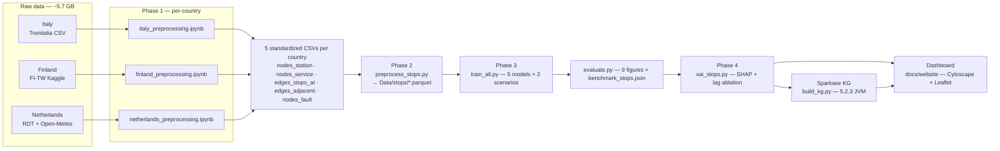
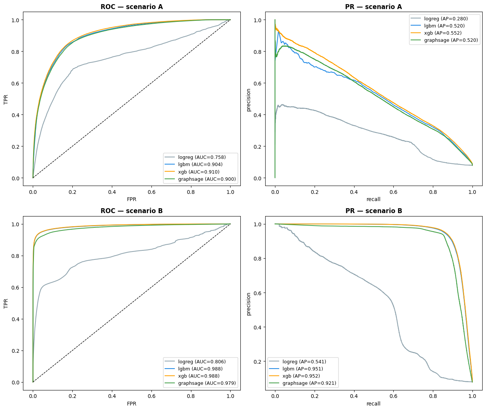
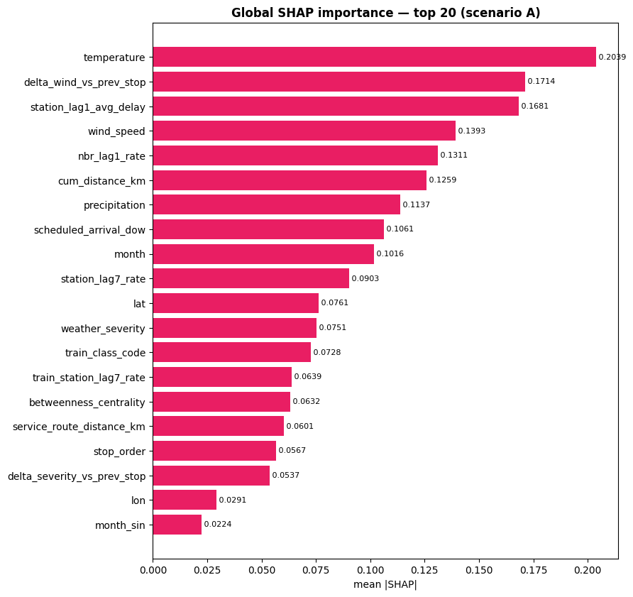
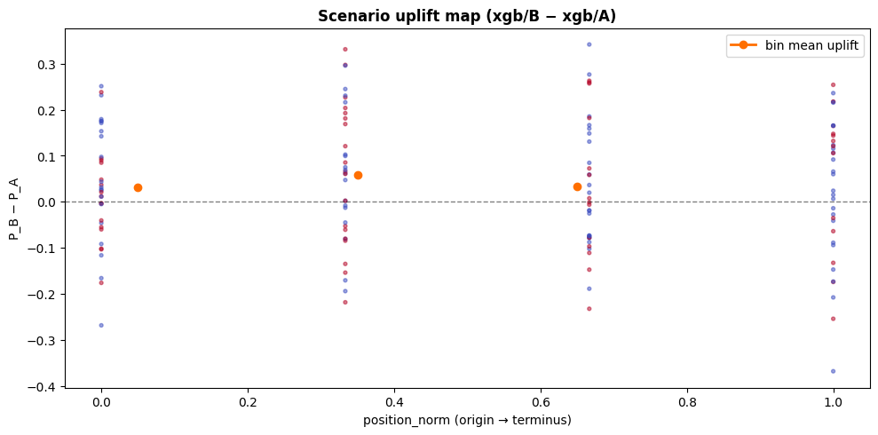
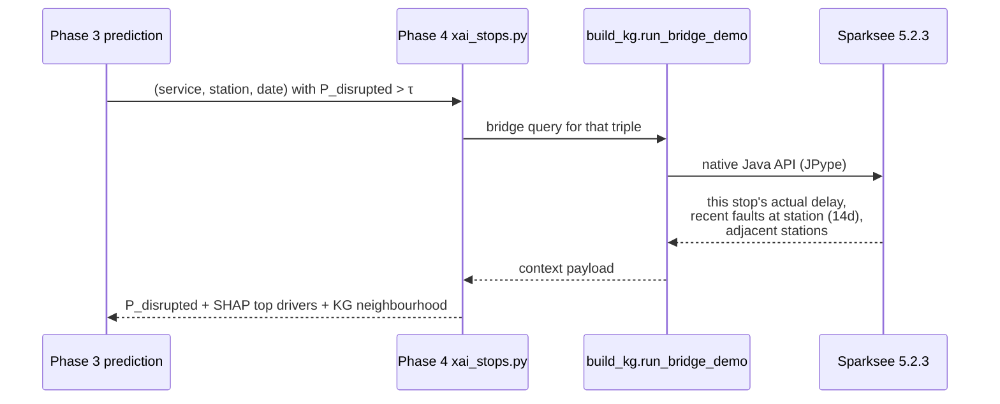

# Technical Report — Stop-Level Disruption Prediction

**Project:** European Railway Stop-Level Disruption Prediction (IT / FI / NL)
**Audience:** the colleague taking this work over.
**Date:** 2026-05-14
**Status:** code structurally sound, 28 / 30 tests pass, paper drafted. 8 BLOCKERs + 3 IMPORTANTs left to resolve before publication (see §10–11).

---

## 1. What this project does

For every scheduled stop of every train in **Italy, Finland and the Netherlands** (Jan–Jun 2024, ~16.6 M stops total), the pipeline predicts `P(disrupted)` where a stop is "disrupted" if its arrival delay exceeds 5 minutes **or** the stop is cancelled. Predictions are made under two operational scenarios — one before departure (planning) and one mid-run (live retiming).

The pipeline turns raw, heterogeneous operator feeds into a unified feature store, trains five competing models, explains them with SHAP, and links every high-risk prediction back to a Sparksee Knowledge Graph for context (recent faults at this station, adjacent stations, on-time history).

---

## 2. Pipeline at a glance



Each phase **owns its own artefacts** (CSVs → parquet → model pickles → figures + JSON). A downstream phase only needs the previous phase's outputs.

---

## 3. What's in the repo, by phase

| Phase | Entry point | Output |
|---|---|---|
| **0. Raw data** | `scripts/download_data.sh` | `Data/{Italy,Finland,Netherlands}/Raw/` (~5.7 GB) |
| **1. Per-country preprocess** | `bash preprocess/run_all_notebooks.sh` | `Data/<Country>/processed/*.csv` (5 standardized CSVs per country) |
| **2. Unified stop store** | `python stop_level/preprocess_stops.py` | `Data/stops/*.parquet` + scaler + graph tensors + feature_names JSON |
| **3. Train zoo** | `python stop_level/train_all.py --model all --scenario both` | `stop_level/models/_artefacts/<model>/<scenario>/{model.*, preds_*.parquet}` |
| **3.5 Evaluate** | `python stop_level/evaluate.py` | 9 figures + `results/benchmark_stops.json` |
| **4. SHAP + KG bridge** | `python stop_level/xai_stops.py --scenario both` | 14 SHAP figures + `results/xai_report_stops.json` |
| **5. KG build (deferred)** | `python stop_level/build_kg.py` | `Data/kg/railway.gdb` + `manifest.json` |
| **6. Dashboard** | `cd docs/website && python -m http.server 8000` | Static site auto-deployed via `.github/workflows/deploy-pages.yml` |

---

## 4. The two prediction scenarios

| | **Scenario A — Pre-departure** *(primary)* | **Scenario B — Inflight** *(secondary)* |
|---|---|---|
| Available at prediction time | timetable + weather forecast + lagged history | A + actual delays at *earlier* stops on the same run |
| Use case | day-ahead planning, passenger alerts | live retiming, propagation forecast |
| Banned features (`leakage_guards.py`) | every same-service delay column | A's banned set MINUS `{prev_stop_actual_delay, cum_actual_delay_so_far, max_actual_delay_so_far}` |
| Feature count | 37 | 40 (= 37 + 3 inflight) |

Each model is trained **twice** (once per scenario) on identical splits so any difference attributes to architecture, not data.

---

## 5. The 5-model zoo

| # | Model | Key hyperparams | Rationale |
|---|---|---|---|
| 1 | **Logistic Regression** | balanced class_weight, SAGA solver | linear baseline |
| 2 | **LightGBM** | 1500 trees, scale_pos_weight, early-stop on val PR-AUC | strong tabular GBDT |
| 3 | **XGBoost** | `tree_method='hist'`, `eval_metric='aucpr'`, 1500 trees | second tabular GBDT — different splitting strategy |
| 4 | **GraphSAGE** | 2 × SAGEConv (mean aggr) + LayerNorm + **Jumping Knowledge concat** + AdamW + cosine LR | does topology add signal beyond hand-engineered centrality? |
| 5 | **BiLSTM stop-sequence** | hidden 128, **bidirectional in A / causal in B**, masked BCE | does the order of weather/topology unfolding along the route matter? |

Cap is intentional — `prompt.md §13` forbids a sixth (and yes, `prompt.md` is itself missing from the repo — see §11 B2).

---

## 6. Anti-leakage discipline (the load-bearing idea)

> At prediction time, `x` may only contain information that was actually available before the prediction is made.

Five enforcement layers:

1. **`leakage_guards.py`** defines `LEAKY_COLS_A` (15 columns) and `LEAKY_COLS_B` (11 columns); `assert_no_leakage` is called immediately before scaler fit.
2. **Lag joins** use **strict `<`** (`shift(1)` after daily aggregation) — verified by `test_lag_strict_lt.py`.
3. **Splits** are day-level so no service crosses train/val/test — verified by `test_split_no_overlap.py` (which constructs an intentional overlap and asserts the error).
4. **Scaler** is fit on `X_train` only; val/test are transformed.
5. **Per-scenario feature lists** are persisted (`feature_names_{A,B}.json`) so downstream consumers can't drift.

Temporal split:

| Split | Window | Source |
|---|---|---|
| Train | 2024-01-01 → 2024-04-30 | Jan–Apr |
| Val | 2024-05-01 → 2024-05-31 | May |
| Test | 2024-06-01 → 2024-06-30 | Jun |

---

## 7. Results (as in `docs/website/data/benchmark.json`)

Headline metric is **PR-AUC** (class is imbalanced — 7.88 % positive on test). All numbers are from the test split (2,303,236 stops).

> **Read PR-AUC against the base rate, not against 0.5.** Unlike ROC-AUC, the random-classifier baseline for PR-AUC equals the positive-class prevalence. Here that's **0.0788** — so a PR-AUC of 0.55 is ~7× random, and 0.95 is ~12× random. ROC-AUC would have been close to 0.5 = random and is therefore *not* the headline (README §8).

| Model | A — PR-AUC | A — F1 | B — PR-AUC | B — F1 | A vs random | B vs random |
|---|---|---|---|---|---|---|
| LogReg | 0.280 | 0.352 | 0.520 | 0.501 | 3.5× | 6.6× |
| LightGBM | 0.552 | 0.530 | 0.951 | 0.903 | 7.0× | 12.1× |
| XGBoost | 0.552 | 0.530 | 0.952 | 0.906 | 7.0× | 12.1× |
| GraphSAGE | 0.520 | — | 0.921 | — | 6.6× | 11.7× |

**The inflight signal dominates** — LightGBM gains +0.43 PR-AUC moving from A → B, and SHAP confirms `prev_stop_actual_delay` is the single largest contributor. The lag-ablation isolates how much of that uplift is from autocorrelation vs the new inflight features (see I9 — caveat about the JSON source).

Key figures (already on disk):








Per-country breakdown (test PR-AUC, LightGBM B): Finland 0.989, Netherlands 0.858, Italy 0.788. The Italian gap is consistent with its smaller test sample (~21k stops vs 1.79M for NL).

---

## 8. Knowledge Graph

**Migrated from Kuzu → Sparksee 5.2.3** in commit `0098ac2`. Lives at `Data/kg/railway.gdb`, built by `stop_level/build_kg.py`.

Schema:

```
Node types:  Station(station_id PK, country, lat, lon, avg_historical_delay, degree)
             TrainService(service_id PK, country, train_class_code, date, is_disrupted)
             FaultEvent(fault_id PK, date, description)

Edge types:  STOPS_AT (TrainService → Station, with delay_minutes, weather_*)
             ADJACENT_TO (Station → Station)
             REPORTED_AT (FaultEvent → Station)
```

The "bridge query" — what the dashboard surfaces after every high-risk prediction — does this:



Latency: **7.7 ms** on the hub subgraph (`build_kg.py:648–714`).

**Caveat (B6):** the Cypher template emitted in `xai_report_stops.json` is **documentation only** — Sparksee speaks its own Java API, not Cypher. The real executor is `run_bridge_demo()`. The dashboard's "live KG query" panel currently shows a *mock* result (`docs/website/js/app.js:776–808`). Either rename the field or stand up a backend microservice — see §11.

---

## 9. Dashboard

`docs/website/` — static site, auto-deployed to GitHub Pages on push to `main` (`.github/workflows/deploy-pages.yml`).

What's there:
- **`index.html`** — interactive map (Leaflet + cluster), per-country filter, sample predictions.
- **`kg.html`** — Cytoscape rendering of the KG schema (3 node types + 3 edge types) and a 102-node / 421-edge sample subgraph (`data/kg_sample.json`).
- **`bake_data.py`** — extracts a baked JSON snapshot from the Python pipeline so the site needs no backend.

Local dev:

```bash
cd docs/website && python -m http.server 8000
```

---

## 10. Verification audit + fixes applied today (2026-05-14)

A 20-agent audit was run across the whole pipeline; the full report is at `/Users/zhiqian/.claude/plans/distributed-snuggling-seahorse.md`. 18 areas verified correct; 23 issues found (8 BLOCKER / 9 IMPORTANT / 6 NIT). **6 of the IMPORTANTs were fixed in this session:**

| ID | Fix | Files touched |
|---|---|---|
| **I1** | GraphSAGE: `Adam → AdamW`, added `CosineAnnealingLR`, added Jumping-Knowledge concat (`station_embed` now returns `torch.cat([h1, h2], dim=-1)`, head input dim `2H + F_tab`). | `stop_level/models/graphsage_model.py` |
| **I2** | Global RNG seeded in `train_all.py::main()` for `random`, `numpy`, and (conditionally — only if a torch-using model is queued) `torch` + CUDA. The conditional import avoids importing torch on tabular-only runs in environments with a broken numpy/torch ABI. | `stop_level/train_all.py` |
| **I3** | Created `requirements.txt` with validated pins: `numpy==1.26.4` (the 2.x ABI break is real — bilstm smoke test currently skips because of it), `xgboost==2.0.3`, `lightgbm==4.3.0` (4.6+ changed the early-stop API), pandas, sklearn, shap, etc. GNN / Open-Meteo / Kaggle / Sparksee-JPype listed as optional. | `requirements.txt` (new) |
| **I4** | Implemented the isotonic-regression calibration hook README §8 promised: `maybe_calibrate(val_df, test_df)` fits `IsotonicRegression` on val when `val_ECE > 0.05`, applies to test probabilities (stored as new `p_disrupted_calibrated` column, raw `p_disrupted` preserved). Results go into `benchmark_stops.json["runs"][i]["calibration"]`. | `stop_level/evaluate.py` |
| **I5** | Finland file glob now uses years from `utils.DATE_START / DATE_END` instead of hardcoded `2024`. A 2025 run only needs the date constants in `utils.py` updated. | `preprocess/lib_finland.py` |
| **I6** | Station count corrected 2397 → 2399 across `01_introduction.tex`, `02_related_work.tex`, `03_data.tex` (text + table cell), `05_models.tex`. The 2399 sums the per-country counts (1399 + 451 + 549). | 4 LaTeX files |

**Tests after the fixes:** `28 passed, 2 skipped, 0 failed` (the 2 skips are the expected clean skips: GraphSAGE when `torch_geometric` isn't installed, BiLSTM when the local numpy/torch ABI is broken — both documented in I3).

---

## 11. What's still open (priority order)

### 🛑 BLOCKERs — do these first

| ID | Issue | Where | Fix sketch |
|---|---|---|---|
| **B1** | **Sparksee license key committed to git.** `sparksee.cfg:1` has the full 1024-char `sparksee.license=…` token. `.gitignore` was added later — key is still in history. | `sparksee.cfg` | Rotate at sparsity-technologies.com, then `git filter-repo --path sparksee.cfg --invert-paths` and force-push. |
| **B2** | **`prompt.md` is missing.** Referenced 4× from README + `xai_stops.py` for foundational decisions (5-model cap, anti-leakage protocol, hyperparameter budgets). | repo root | Locate the original or write a 1-page `DESIGN.md` capturing decisions the code already implements. |
| **B3** | **`HOLIDAYS_2024` wrong for IT/FI/NL.** Contains 2024-05-17 (Norwegian Constitution Day) and is missing IT Epiphany/Republic Day, FI Epiphany/Midsummer, NL King's Day/Liberation Day/Whit Sunday. | `stop_level/features.py:31–34` | Three country-specific sets keyed by `country` column; move to `utils.py` to match the README. |
| **B4** | **LogReg silently runs on UNSCALED data.** Comment in `logreg.py:38–40` claims pre-scaling, but `preprocess_stops.py` writes parquet raw and saves `scaler_*.npy` separately — and no model loads them. | `stop_level/models/logreg.py`, `stop_level/preprocess_stops.py` | Either apply transform before writing parquet, or have each model load the scaler in `fit/predict`. |
| **B5** | **Lag-ablation in `xai_stops.py` understates the lag contribution.** Only drops `*_lag*` columns; the three inflight features stay in for scenario B, so the Δ=0.597 reported in `xai.json:333` conflates two signals. | `stop_level/xai_stops.py:246–264` | Also exclude `LEAKY_COLS_A − LEAKY_COLS_B` (the inflight whitelist) from the no-lag feature set. |
| **B6** | **Cypher template can't run on Sparksee.** See §8. The dashboard's "live KG" panel is a mock. | `xai_stops.py:375–384`, `docs/website/js/app.js:776–808` | Either rename + document as "canonical form", or stand up a Flask/FastAPI backend wrapping `run_bridge_demo`. |
| **B7** | **Open-Meteo NL weather joined SAME-DAY.** Possible leakage in scenario A if treated as observed weather; defensible if treated as a day-ahead forecast. Currently ambiguous. | `preprocess/weather_enrichment_nl.py:186` | Lag the join by 1 day, OR add a clear comment + paper note that "day-D aggregates are treated as day-D forecasts prepared on day D−1". |
| **B8** | Dashboard KG-bridge result is a mock. | `docs/website/js/app.js:776–808` | Add a clear "Demo result" banner, or build the backend. |

### ⚠️ IMPORTANTs still open (after today's 6 fixes)

| ID | Issue | Note |
|---|---|---|
| **I7** | "Finland: disruption rate climbs to 38 % on bad-weather days" (`01_introduction.tex:10`) has no source in any JSON. | Either compute and cite, or soften. |
| **I8** | Date window is dual-sourced — `utils.DATE_START/END` AND `splits.TRAIN_START/...` (hardcoded). | Import from `utils.py` or move the four split boundaries into a single constant. |
| **I9** | **`docs/website/data/{benchmark,xai,causes}.json` already contain every number the paper cites, but README §13 still says "real-data run deferred to operational runs".** This is the single highest-priority reviewer question. | Confirm provenance — real run vs sample run — and update either the README or the paper accordingly. |

### 🔧 NITs

- N1 `headway_to_train_ahead` phantom in `LEAKY_COLS_A` (defensive, harmless).
- N2 Tautological tests in `test_no_leakage_{A,B}.py:25–35` (assert constants exist).
- N3 `utils.COUNTRY_PREFIX` is dead code.
- N4 `xai_stops.py:10` references `prompt.md §8` — verify section numbers once B2 is resolved.
- N5 `latex.zip` (2.8 MB) is untracked at the repo root — `.gitignore` or delete.
- N6 README §10 doesn't mention `scripts/install_sparksee.sh` for Phase 5.

---

## 12. Reproduction — 4-step contract

```bash
# 0. Install dependencies (USE THE NEW requirements.txt)
pip install -r requirements.txt
# Optional GPU/GNN: pip install torch==2.2.2 torch_geometric==2.5.3
# Optional Finland download: pip install kaggle==1.6.14

# 1. Download raw data (~5.7 GB on disk)
bash scripts/download_data.sh
( cd Data && shasum -a 256 -c ../scripts/SHASUMS.txt | head )    # spot-check

# 2. Per-country preprocessing (papermill-driven)
bash preprocess/run_all_notebooks.sh

# 3. Unified stop store + train zoo + evaluate + XAI
python stop_level/preprocess_stops.py
python stop_level/train_all.py --model all --scenario both
python stop_level/evaluate.py
python stop_level/xai_stops.py --scenario both

# 4. (Optional) Build the Sparksee KG
bash scripts/install_sparksee.sh
python stop_level/build_kg.py
```

Tests:

```bash
python -m pytest stop_level/tests/ -q
# Currently: 28 passed, 2 skipped (graphsage if no torch_geometric, bilstm if numpy 2.x), 0 failed
```

---
