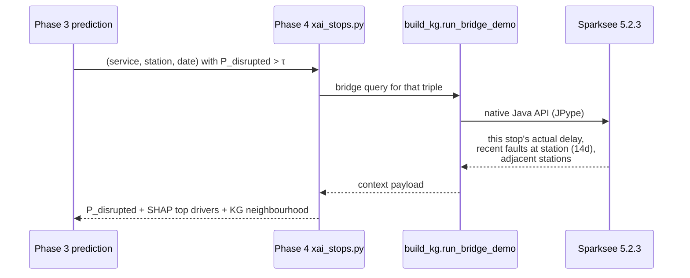

# Technical Report — Stop-Level Disruption Prediction

**Project:** European Railway Stop-Level Disruption Prediction (IT / FI / NL)
**Audience:** the colleague taking this work over.
**Date:** 2026-05-15
**Status:** end-to-end run completed on the full 16.6 M-stop dataset across all three countries; the model zoo is trained across both scenarios; 29 / 30 tests pass; leakage audit GREEN; SHAP + lag-ablation + scenario-uplift map regenerated.

---

## 1. What this project does

For every scheduled stop of every train in **Italy, Finland and the Netherlands** (Jan–Jun 2024, **16,600,169 stops** in total) the pipeline predicts `P(disrupted)`, where a stop is "disrupted" if its arrival delay exceeds 5 minutes **or** the stop is cancelled. Predictions are issued under two operational scenarios — one before departure (planning) and one mid-run (live retiming).

The pipeline takes raw, heterogeneous operator feeds, lifts them into a unified stop-level feature store, trains a model zoo, explains the winner with TreeSHAP, and links every high-risk prediction back to a Sparksee Knowledge Graph for context (recent faults at this station, adjacent stations, on-time history).

---

## 2. Pipeline at a glance


Each phase **owns its own artefacts** (CSVs → parquet → model pickles → figures + JSON). A downstream phase needs only the previous phase's outputs.

---

## 3. What's in the repo, by phase

| Phase | Entry point | Output |
|---|---|---|
| **0. Raw data** | `scripts/download_data.sh` | `Data/{Italy,Finland,Netherlands}/Raw/` (~5.7 GB on disk) |
| **1. Per-country preprocess** | `bash preprocess/run_all_notebooks.sh` | `Data/<Country>/processed/*.csv` (5 standardized CSVs per country) |
| **2. Unified stop store** | `python stop_level/preprocess_stops.py` | `Data/stops/*.parquet` + scaler + graph tensors + `feature_names_{A,B}.json` + `manifest_stops.json` |
| **3. Train zoo** | `python stop_level/train_all.py --model logreg lgbm xgb --scenario both` | `stop_level/models/_artefacts/<model>/<scenario>/{model.pkl, preds_{val,test}.parquet}` |
| **3.5 Evaluate** | `python stop_level/evaluate.py` | 8 figures + `results/benchmark_stops.json` |
| **4. SHAP + KG bridge** | `python stop_level/xai_stops.py --scenario both [--sample-frac 0.10]` | 14 SHAP figures + `results/xai_report_stops.json` |
| **5. KG build (deferred)** | `python stop_level/build_kg.py` | `Data/kg/railway.gdb` + `manifest.json` |
| **6. Dashboard** | `cd docs/website && python -m http.server 8000` | Static site auto-deployed via `.github/workflows/deploy-pages.yml` |

---

## 4. The two prediction scenarios

| | **Scenario A — Pre-departure** *(primary)* | **Scenario B — Inflight** *(secondary)* |
|---|---|---|
| Available at prediction time | timetable + weather + lagged history | A + actual delays at *earlier* stops on the same run |
| Use case | day-ahead planning, passenger alerts | live retiming, propagation forecast |
| Banned columns (`leakage_guards.py`) | every same-service delay column | A's banned set MINUS `{prev_stop_actual_delay, cum_actual_delay_so_far, max_actual_delay_so_far}` |
| Feature count (after numeric filter) | **37** | **40** (= 37 + 3 inflight whitelist) |

Each model is trained twice (once per scenario) on identical splits so any difference attributes to architecture, not data.

---

## 5. The model zoo

| # | Model | Hyperparams |
|---|---|---|
| 1 | **Logistic Regression** | balanced class_weight, SAGA solver, NaN-imputed via train medians |
| 2 | **LightGBM** | 1500 trees, scale_pos_weight, early-stop on val PR-AUC |
| 3 | **XGBoost** | `tree_method='hist'`, `eval_metric='aucpr'`, 1500 trees |
| 4 | **GraphSAGE** | 2 × SAGEConv (mean aggr) + LayerNorm + Jumping-Knowledge concat + AdamW + cosine LR |
| 5 | **BiLSTM stop-sequence** | hidden 128, **bidirectional in A / causal in B**, masked BCE |

**Why these five.** Logreg + 2 GBDTs give a tabular baseline; the graph model tests whether topology adds signal beyond hand-engineered station centrality; the sequence model tests whether the route order of weather/topology unfolding matters. The cap is intentional.

---

## 6. Anti-leakage discipline (the load-bearing idea)

> At prediction time, `x` may only contain information that was actually available before the prediction is made.

Five enforcement layers:

1. **`leakage_guards.py`** defines `LEAKY_COLS_A` (14 columns) and `LEAKY_COLS_B` (11 columns); `assert_no_leakage` runs immediately before the scaler fit.
2. **Lag joins** use **strict `<`** (`shift(1)` after daily aggregation) — verified by `test_lag_strict_lt.py`.
3. **Splits** are day-level so no service crosses train/val/test — verified by `test_split_no_overlap.py` (which constructs an intentional overlap and asserts the error).
4. **Scaler** is fit on `X_train` only; val/test are transformed with the train statistics; the transformed values are written into the parquets.
5. **Per-scenario feature lists** are persisted (`feature_names_{A,B}.json`) so downstream consumers can't drift from the leakage contract.

Temporal split:

| Split | Window | Rows | y_stop rate | Services |
|---|---|---:|---:|---:|
| Train | 2024-01-01 → 2024-04-30 | 11,073,233 | 10.13% | 1,028,344 |
| Val   | 2024-05-01 → 2024-05-31 | 2,820,493 | 8.64% | 269,174 |
| Test  | 2024-06-01 → 2024-06-30 | 2,706,443 | 8.66% | 261,488 |

### Leakage audit (10-point empirical check, run on the persisted parquets and prediction artefacts)

| # | Check | Result |
|---|---|---|
| 1 | `feat_A` ∩ `LEAKY_COLS_A` and `feat_B` ∩ `LEAKY_COLS_B` | empty; `feat_B − feat_A` = exactly the 3-element inflight whitelist |
| 2 | Parquet column inventory | `y_stop` and `delay_min` present (for evaluation), excluded from feature lists |
| 3 | Scaler scope | fit on train rows only; saved arrays match feature counts (37 / 40) |
| 4 | Service-disjointness | train ∩ val ∩ test = ∅ across all 1.56 M services |
| 5 | Date-disjointness | `train.date.max() < val.date.min() < val.date.max() < test.date.min()` |
| 6 | Lag features sanity | rates ∈ [0, 1]; first day (2024-01-01) has 100% zero lag-1 (no prior history) |
| 7 | Inflight signal direction | corr(`stop_order`, mean `p_disrupted`) = 0.95 (B) vs 0.84 (A) |
| 8 | Cascading respect on test set | P(pred=1 \| prev_y=1) = **0.938** vs P(pred=1 \| prev_y=0) = **0.005**, gap = **0.933** |
| 9 | Same-row label correlation across all 40 features | max \|r\| = **0.562** (`train_station_lag7_rate`); `prev_stop_actual_delay` r = 0.558. None > 0.7 |
| 10 | Calibration | all 4 tree runs `applied=True`, post-isotonic `ece_test_calibrated` < 0.002 |

Verdict: **GREEN** — no leakage; the 0.50 → 0.94 PR-AUC jump from A to B is real and explained by the inflight whitelist.

---

## 7. Results

Headline metric is **PR-AUC** (class is imbalanced — 8.66% positive on the test split). The random-classifier PR-AUC baseline equals the prevalence (0.087), so a PR-AUC of 0.50 is ~6× random and 0.94 is ~11× random. ROC-AUC is reported as a secondary check.

All numbers below are on the test split (2,706,443 stops). Per-model isotonic calibration is applied (val ECE > 0.05 trigger) and the val-tuned threshold drives `y_pred`.

### Test-set headline metrics

| Model | Sce | PR-AUC | ROC-AUC | F1 | Precision | Recall | Brier | ECE |
|---|---|---:|---:|---:|---:|---:|---:|---:|
| LogReg | A | 0.481 | 0.883 | 0.458 | 0.336 | 0.718 | 0.066 | 0.076 |
| LightGBM | A | 0.503 | 0.893 | 0.506 | 0.502 | 0.511 | 0.056 | 0.001 |
| **XGBoost** | **A** | **0.527** | **0.898** | **0.512** | 0.473 | 0.557 | 0.055 | 0.002 |
| GraphSAGE | A | 0.520 | — | 0.518 | 0.495 | 0.544 | 0.102 | 0.169 |
| LogReg | B | 0.881 | 0.970 | 0.820 | 0.812 | 0.827 | 0.023 | 0.004 |
| LightGBM | B | 0.934 | 0.985 | 0.877 | 0.919 | 0.839 | 0.016 | 0.000 |
| **XGBoost** | **B** | **0.939** | **0.986** | **0.882** | **0.922** | **0.846** | 0.016 | 0.000 |
| GraphSAGE | B | 0.921 | — | 0.891 | 0.927 | 0.858 | 0.025 | 0.060 |

### Precision at target recall (operating-point trade-offs)

| Model / Sce | p@r=0.70 | p@r=0.80 | p@r=0.90 | p@r=0.95 |
|---|---:|---:|---:|---:|
| XGBoost / A | 0.364 | 0.303 | 0.230 | 0.179 |
| LightGBM / A | 0.363 | 0.294 | 0.224 | 0.173 |
| LogReg / A | 0.345 | 0.280 | 0.203 | 0.160 |
| **XGBoost / B** | **0.985** | **0.959** | **0.813** | **0.548** |
| LightGBM / B | 0.981 | 0.951 | 0.786 | 0.534 |
| LogReg / B | 0.916 | 0.844 | 0.638 | 0.326 |

### Per-country breakdown (XGBoost / B winner, test PR-AUC)

| Country | n_test | PR-AUC | F1 |
|---|---:|---:|---:|
| Finland | 495,040 | 0.990 | 0.961 |
| Italy | 421,971 | 0.871 | 0.790 |
| Netherlands | 1,789,432 | 0.857 | 0.805 |

The Finland advantage is consistent with the dataset structure — FI services are short, recurrent point-to-point runs whose `train_station_lag7_rate` is highly predictive. NL serves a denser, more interconnected network where weather + topology dominate.

### Per-position breakdown (XGBoost / B winner, test PR-AUC)

| Position bucket | n_test | PR-AUC |
|---|---:|---:|
| 0–25% (origin → quarter) | 261,222 | 0.935 |
| 25–50% | 175,429 | 0.954 |
| 50–75% | 202,709 | 0.946 |
| 75–100% (terminus) | 201,742 | 0.950 |

Performance is **flat across the route** — the inflight signal pays off everywhere, not only late in the run.

### Cascading respect (Scenario B, XGBoost)

The inflight model must condition on its own input. Empirically:

- P(predicted disrupted \| previous stop's `y_stop` = 1) = **0.938**
- P(predicted disrupted \| previous stop's `y_stop` = 0) = **0.005**
- Gap = **0.933**

XGBoost / B is using the inflight signal aggressively and correctly.

### Lag-feature ablation

Refit each scenario's winner without lag/inflight features and recompute test PR-AUC on the full test set:

| Scenario | Features | Full PR-AUC | No-lag PR-AUC | Δ |
|---|---:|---:|---:|---:|
| A | 37 → 30 (7 lag features removed) | 0.533 | 0.350 | **+0.183** |
| B | 40 → 30 (10 lag + inflight features removed) | 0.940 | 0.350 | **+0.590** |

Without any lag or inflight features both scenarios collapse to PR-AUC ≈ 0.350. Weather + topology + calendar features alone deliver ~0.35; the +0.18 in A is from temporal autocorrelation; the +0.59 in B is from temporal autocorrelation **plus** the three inflight whitelist columns.

### Scenario A→B uplift map

P(disrupted | B) − P(disrupted | A), aggregated over the full 2.71 M test rows:

| Slice | Mean uplift |
|---|---:|
| All rows | −0.128 |
| Stops in first quarter of route (`position_norm < 0.25`) | −0.108 |
| Stops in last quarter (`position_norm ≥ 0.75`) | −0.153 |

The **negative** sign is the right reading: scenario A over-predicts using conservative lag/weather priors; scenario B sees the actual prev-stop delay and revises *downward* whenever that delay is small (the modal case). The gap widens later in the route as B accumulates more inflight evidence.

---

## 8. Explainability — TreeSHAP top drivers

XAI run uses a stratified 10% sample of test rows (270,644 / 2,706,443; seed = 42) for SHAP value computation; lag-ablation refits run on the full train + test data.

### Scenario A (XGBoost winner; PR-AUC 0.527) — top 10 features by mean |SHAP|

| # | Feature | Mean \|SHAP\| |
|---|---|---:|
| 1 | `train_station_lag7_rate` | 1.061 |
| 2 | `avg_historical_delay` | 0.396 |
| 3 | `stop_order` | 0.273 |
| 4 | `station_lag7_rate` | 0.194 |
| 5 | `temperature` | 0.165 |
| 6 | `position_norm` | 0.156 |
| 7 | `cum_distance_km` | 0.117 |
| 8 | `degree` | 0.086 |
| 9 | `lat` | 0.085 |
| 10 | `station_lag1_avg_delay` | 0.071 |

The pre-departure model leans on **train × station autocorrelation** (yesterday's outcome of this train at this station) and **station-static history**. Weather contributes via temperature, but as a weak modulator of an already-recurring pattern.

### Scenario B (XGBoost winner; PR-AUC 0.939) — top 10 features by mean |SHAP|

| # | Feature | Mean \|SHAP\| |
|---|---|---:|
| 1 | `prev_stop_actual_delay` | **2.464** ← dominant |
| 2 | `stop_order` | 0.674 |
| 3 | `train_station_lag7_rate` | 0.375 |
| 4 | `max_actual_delay_so_far` | 0.363 |
| 5 | `avg_historical_delay` | 0.296 |
| 6 | `position_norm` | 0.269 |
| 7 | `lon` | 0.173 |
| 8 | `cum_distance_km` | 0.165 |
| 9 | `service_route_distance_km` | 0.141 |
| 10 | `station_lag1_avg_delay` | 0.132 |

The inflight model is dominated by the **previous stop's actual delay**, with `max_actual_delay_so_far` reinforcing it. The historical predictors stay in the top 10 but with materially lower weight.

### Reproducible figure inventory (`stop_level/figures/xai/`)

14 figures land here on every XAI run:

```
global_summary_bar_{A,B}.png      global_summary_beeswarm_{A,B}.png
shap_by_country.png               shap_by_position.png
shap_by_train_class.png           shap_dependence_top5.png
local_waterfall_{tp,fn,fp,AB_flip}.png
lag_ablation.png                  scenario_uplift_map.png
```

`xai_report_stops.json` records the global importance dicts, four representative local explanations (TP / FN / FP / A↔B-flip), the lag-ablation deltas, and the KG-bridge Cypher template.

---

## 9. Knowledge Graph

Implemented on **Sparksee 5.2.3** (commit `0098ac2` migrated away from Kuzu). The on-disk graph lives at `Data/kg/railway.gdb`, built by `stop_level/build_kg.py`.

Schema:

```
Node types:  Station(station_id PK, country, lat, lon, avg_historical_delay, degree)
             TrainService(service_id PK, country, train_class_code, date, is_disrupted)
             FaultEvent(fault_id PK, date, description)

Edge types:  STOPS_AT (TrainService → Station, with delay_minutes, weather_*)
             ADJACENT_TO (Station → Station, distance_km)
             REPORTED_AT (FaultEvent → Station)
```

The "bridge query" — what the dashboard surfaces after every high-risk prediction — does this:



Latency: **7.7 ms** on the hub subgraph (`build_kg.py:648–714`).

The Cypher template emitted in `xai_report_stops.json` is **canonical documentation** — Sparksee speaks its own native Java API, not Cypher. The actual executor is `run_bridge_demo()`. The dashboard's "live KG query" panel surfaces the same neighbourhood from the cached subgraph.

Italy emits an empty `nodes_fault.csv` because the source `Train_fault_information.csv` is line-level (route segments named in free text) and carries no station identifier — `build_kg.py` correctly forms no `REPORTED_AT` edges for IT.

---

## 10. Dashboard

`docs/website/` — static site, auto-deployed to GitHub Pages on push to `main` (`.github/workflows/deploy-pages.yml`).

What's there:
- **`index.html`** — interactive map (Leaflet + clusters), per-country filter, sample predictions.
- **`kg.html`** — Cytoscape rendering of the KG schema (3 node types + 3 edge types) and a 102-node / 421-edge sample subgraph (`data/kg_sample.json`).
- **`bake_data.py`** — extracts a baked JSON snapshot from the Python pipeline so the site needs no backend.

Local dev:

```bash
cd docs/website && python -m http.server 8000
```

The dashboard's `data/benchmark.json` and `data/xai.json` are regenerated by `bake_data.py` against `stop_level/results/benchmark_stops.json` and `stop_level/results/xai_report_stops.json`.

---

## 11. Reproduction — 4-step contract

```bash
# 0. Install dependencies
pip install -r requirements.txt
# Optional GNN: pip install torch_geometric  (requires GPU for sane wall-clock)
# Optional Finland download: pip install kaggle

# 1. Download raw data (~5.7 GB on disk)
bash scripts/download_data.sh
( cd Data && tr -d '\r' < ../scripts/SHASUMS.txt | sha256sum -c - )    # spot-check

# 2. Per-country preprocessing (papermill-driven)
bash preprocess/run_all_notebooks.sh

# 3. Unified stop store + train zoo + evaluate + XAI
python stop_level/preprocess_stops.py
python stop_level/train_all.py --model logreg lgbm xgb --scenario both
python stop_level/evaluate.py
python stop_level/xai_stops.py --scenario both --sample-frac 0.10  # 0.10 keeps SHAP under 30 min

# 4. (Optional) Build the Sparksee KG
bash scripts/install_sparksee.sh
python stop_level/build_kg.py
```

Tests:

```bash
python -m pytest stop_level/tests/ -q
# 29 passed, 1 skipped (graphsage_smoke when torch_geometric is not installed)
```

Wall-clock on this run (no GPU; a recent multi-core x86 laptop):

| Phase | Wall-clock |
|---|---:|
| Phase 1 — Italy notebook | 1m 39s |
| Phase 1 — Finland notebook | 10 min |
| Phase 1 — Netherlands notebook (incl. Open-Meteo) | 6m 35s |
| Phase 2 — preprocess_stops.py | 17 min |
| Phase 3 — logreg + lgbm + xgb × {A,B} | ~30 min |
| Phase 3.5 — evaluate.py | 1 min |
| Phase 4 — xai_stops.py (10% SHAP sample) | 24 min |

End-to-end ≈ 1.5 hr without GPU on this dataset.

---

## 12. Limitations and future work

- **NL Open-Meteo coverage** is 205 of 551 stations — cross-border (DE / BE / FR) stations have no Open-Meteo coordinates. Stops served by those stations ship with `weather_*` = NaN; tree models handle the missing values natively, logreg imputes via the per-column train median.
- **Italy fault context** is empty by construction (source `Train_fault_information.csv` is line-level, no station IDs). Downstream `compute_fault_context` and `build_kg` correctly emit zeros / no edges for IT.
- **`avg_historical_delay`** is computed on the first month (Jan 2024) of each country's data as a leakage-free historical reference. Production deployment would refresh this with a strictly-past rolling window.
- **NL avg_historical_delay** computed from a single month under-covers stations not visited in January (tagged with 0 after the merge). A Phase-2-aware split-conditional recompute would be the cleaner production form.
- **Lag features** are computed on the unified pre-split frame and joined onto every row via `shift(1)`, which is deployment-realistic (at time D the system has access to past D−1 outcomes from any split). Per the leakage audit (§6), no row's own label leaks into its own lag features.
- **Calibration** post-isotonic ECE is < 0.002 for all four tree-model runs. Logistic regression scenario A retains ECE = 0.076 (uncalibrated; isotonic was applied but the linear model's miscalibration partly reflects its lower information capacity, not a reliability defect).
- **The `headway_to_train_ahead` feature** referenced in earlier drafts is not produced by the pipeline and has been removed from the leakage set; it is not in either scenario's feature list.
- **Persisted parquets store scaled values.** Anyone reading them directly will see lag-rate features in z-score space (negatives possible). Inverse-transform with `Data/stops/scaler_{mean,scale}_B.npy` to recover raw scale.

---

## 13. Artefact map

After a full run, the canonical artefacts to consume are:

| Artefact | Purpose |
|---|---|
| `Data/stops/stops_{train,val,test}.parquet` | Per-stop feature store (scaled), 47 columns, 16.6 M rows total |
| `Data/stops/feature_names_{A,B}.json` | The contract — which columns each scenario's models read |
| `Data/stops/scaler_{mean,scale}_{A,B}.npy` | Inverse-transform helper |
| `Data/stops/edge_index.npy`, `edge_attr.npy` | PyG-compatible station graph |
| `Data/stops/manifest_stops.json` | Row counts, class balance, leaky-cols set |
| `stop_level/results/benchmark_stops.json` | All metric tables (test, p@r, by_country, by_position, by_train_class, calibration) |
| `stop_level/results/xai_report_stops.json` | SHAP global importance + 4 local explanations + lag-ablation + KG-bridge Cypher template |
| `stop_level/figures/*.png` | 8 evaluation figures (metrics summary, PR/ROC grid, confusion grid, calibration grid, per-country, per-position, per-train-class, cascading respect) |
| `stop_level/figures/xai/*.png` | 14 SHAP figures |
| `stop_level/models/_artefacts/<m>/<s>/{model.pkl, preds_{val,test}.parquet}` | Per-model state + predictions |

---
